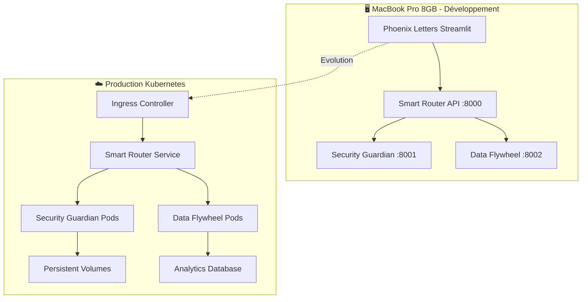

# 🚀 PHOENIX LETTERS - AGENTS IA CONTAINERISÉS

## Architecture Docker → Kubernetes pour MacBook Pro 8GB


---

## 🎯 **VISION ARCHITECTURALE**



---

## 🏗️ **ARCHITECTURE MICROSERVICES**

### **🛡️ Security Guardian Agent**
- **Modèle** : Phi-3.5:3.8b (2.2GB)
- **Spécialité** : RGPD, détection menaces, compliance
- **API** : REST sur port 8001
- **Container** : 3GB RAM max

### **🧠 Data Flywheel Agent**
- **Modèle** : Qwen2.5:3b (1.9GB) 
- **Spécialité** : Analytics, apprentissage continu
- **API** : REST sur port 8002
- **Container** : 3GB RAM max

### **🎯 Smart Router Gateway**
- **Rôle** : Orchestrateur intelligent
- **Features** : Fallback cloud, load balancing
- **API** : REST sur port 8000
- **Container** : 512MB RAM

---

## 🚀 **DÉMARRAGE RAPIDE**

### **Prérequis**
```bash
# Docker & Docker Compose
docker --version
docker-compose --version

# Espace disque : 15GB minimum
# RAM disponible : 6GB minimum
```

### **Lancement complet**
```bash
cd docker/
chmod +x test-docker.sh
./test-docker.sh
```

### **Lancement manuel**
```bash
# Construction des images
docker-compose build

# Démarrage des services
docker-compose up -d

# Vérification santé
curl http://localhost:8000/health
```

---

## 📊 **MONITORING & OBSERVABILITÉ**

### **URLs de monitoring**
```bash
# APIs principales
- Smart Router: http://localhost:8000/docs
- Security Guardian: http://localhost:8001/docs  
- Data Flywheel: http://localhost:8002/docs

# Monitoring (optionnel)
- Prometheus: http://localhost:9090
- Grafana: http://localhost:3000 (admin/phoenix2025)
```

### **Métriques temps réel**
```bash
# Utilisation ressources
docker stats

# Logs agrégés
docker-compose logs -f

# Santé globale
curl http://localhost:8000/health | jq
```

---

## 🧪 **TESTS & VALIDATION**

### **Tests automatisés**
```bash
# Test complet avec script
./docker/test-docker.sh

# Tests unitaires des APIs
curl -X POST http://localhost:8001/api/security/analyze \
  -H "Content-Type: application/json" \
  -d '{"content": "Test CV", "content_type": "cv"}'
```

### **Tests de charge**
```bash
# Test performance
ab -n 100 -c 10 http://localhost:8000/health

# Surveillance mémoire
watch docker stats --format "table {{.Name}}\t{{.MemUsage}}\t{{.CPUPerc}}"
```

---

## ☸️ **ÉVOLUTION KUBERNETES**

### **Migration Docker → K8s**
```bash
# 1. Préparation cluster
kubectl create -f k8s/namespace.yaml

# 2. Déploiement services
kubectl apply -f k8s/security-guardian.yaml
kubectl apply -f k8s/data-flywheel.yaml
kubectl apply -f k8s/smart-router.yaml

# 3. Validation
kubectl get pods -n phoenix-letters
```

### **Scaling automatique**
```yaml
# HPA configuré pour:
- Min replicas: 2
- Max replicas: 5  
- CPU target: 70%
- Memory target: 80%
```

---

## 🔧 **CONFIGURATION AVANCÉE**

### **Variables d'environnement**
```bash
# Docker Compose
export GEMINI_API_KEY="your-key"
export MAX_RESPONSE_TIME="10"
export ENABLE_CLOUD_FALLBACK="true"

# Kubernetes
kubectl create secret generic phoenix-secrets \
  --from-literal=gemini-api-key="your-key" \
  -n phoenix-letters
```

### **Optimisation performance**
```yaml
# docker-compose.override.yml
services:
  security-guardian:
    deploy:
      resources:
        reservations:
          memory: 3G
          cpus: '1.0'
```

---

## 📈 **INTÉGRATION PHOENIX LETTERS**

### **Code Streamlit**
```python
import httpx
import asyncio

class PhoenixAIClient:
    def __init__(self):
        self.base_url = "http://localhost:8000"
    
    async def analyze_complete(self, cv, job_offer, letter):
        async with httpx.AsyncClient() as client:
            response = await client.post(
                f"{self.base_url}/api/phoenix/analyze",
                json={
                    "cv_content": cv,
                    "job_offer": job_offer,
                    "generated_letter": letter,
                    "user_tier": "free",
                    "enable_learning": True
                }
            )
            return response.json()

# Usage dans Streamlit
ai_client = PhoenixAIClient()
result = asyncio.run(ai_client.analyze_complete(cv, job, letter))

if result["security_passed"]:
    st.success("✅ Analyse sécurisée réussie")
    st.json(result["learning_insights"])
```

---

## 🛡️ **SÉCURITÉ & PRODUCTION**

### **Bonnes pratiques**
- ✅ Containers non-root
- ✅ Network policies K8s
- ✅ Secrets management
- ✅ Resource limits
- ✅ Health checks
- ✅ Logs sécurisés

### **Monitoring production**
```bash
# Alertes recommandées
- Memory usage > 90%
- API response time > 10s
- Error rate > 5%
- Model loading failures
```

---

## 🚧 **DÉPANNAGE**

### **Problèmes courants**
```bash
# Modèles lents à charger
docker-compose logs security-guardian | grep "Installing"

# Mémoire insuffisante  
docker stats --format "table {{.Name}}\t{{.MemUsage}}"

# Services non disponibles
curl -I http://localhost:8001/health
```

### **Reset complet**
```bash
# Nettoyage total
docker-compose down --volumes --remove-orphans
docker system prune -af
docker volume prune -f

# Redémarrage propre
docker-compose up --build -d
```

---

## 🎯 **ROADMAP ÉVOLUTION**

### **Phase 1 : Docker Local (✅ Actuel)**
- [x] Architecture microservices
- [x] APIs REST complètes
- [x] Monitoring basique
- [x] Tests automatisés

### **Phase 2 : Kubernetes Production**
- [ ] Déploiement cluster K8s
- [ ] Ingress & Load Balancing
- [ ] Monitoring avancé (Prometheus/Grafana)
- [ ] CI/CD Pipeline

### **Phase 3 : Cloud Scaling**
- [ ] Multi-cloud deployment
- [ ] Auto-scaling intelligent  
- [ ] Edge computing
- [ ] MLOps integration

---

## 🤝 **CONTRIBUTION**

### **Structure projet**
```
agent_ia/
├── docker/                 # Configuration Docker
│   ├── Dockerfile.*        # Images spécialisées
│   ├── docker-compose.yml  # Orchestration
│   └── test-docker.sh      # Tests automatisés
├── k8s/                    # Manifests Kubernetes
├── *.py                    # Agents IA & APIs
└── README.md               # Documentation
```

### **Standards de développement**
- 🐍 Python 3.11+
- 🚀 FastAPI pour les APIs
- 🐳 Docker multi-stage builds
- ☸️ Kubernetes-native
- 📊 Monitoring intégré

---

## 📞 **SUPPORT**

- **Documentation** : Voir `/docs` de chaque API
- **Logs** : `docker-compose logs -f`
- **Métriques** : `curl localhost:8000/health`
- **Issues** : GitHub Issues du projet Phoenix

---

**🎉 Félicitations ! Ton architecture Docker → Kubernetes Phoenix Letters est prête pour l'évolution ! 🚀**