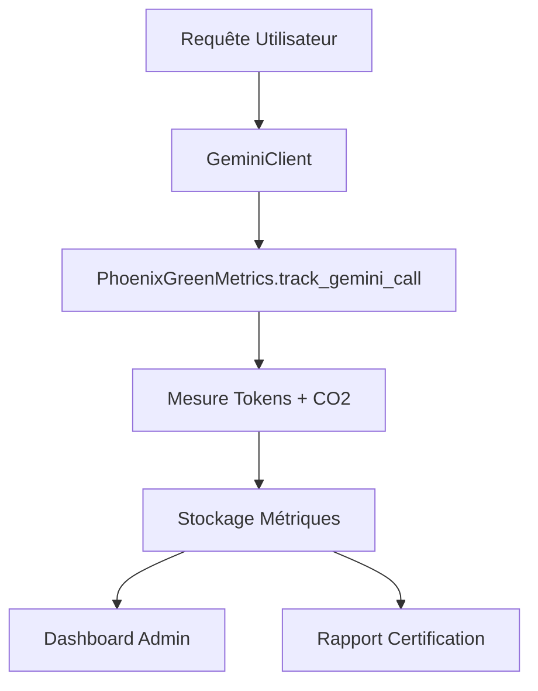

# 🌱 Phoenix Green AI - Guide Technique Complet

## 📋 Vue d'Ensemble

**Phoenix Green AI** est le système de tracking carbone intégré à Phoenix Letters, conçu pour mesurer, optimiser et certifier l'empreinte environnementale de notre générateur de lettres de motivation alimenté par l'IA.

### 🎯 Objectifs Principaux

- **Transparence environnementale** : Métriques CO2 publiques et auditables
- **Optimisation continue** : Réduction automatique de l'empreinte carbone
- **Certification ISO/IEC 42001** : Conformité aux standards Green AI
- **Leadership marché** : Premier générateur "Green AI" français

---

## 🏗️ Architecture Système

### 📦 Composants Principaux

```
Phoenix Green AI
├── 🌱 PhoenixGreenMetrics         # Module central de tracking
├── 📊 GreenAdminDashboard         # Interface d'administration  
├── 🔌 GeminiClient (Enhanced)     # Client IA avec tracking intégré
├── 🧪 Tests complets              # Suite de tests unitaires
└── 📋 Certification Reports       # Génération rapports audit
```

### 🔄 Flux de Données



---

## 🔧 Installation et Configuration

### 📦 Dépendances Requises

```python
# requirements.txt
plotly>=5.0.0          # Visualisations dashboard
pandas>=1.5.0          # Manipulation données
streamlit              # Interface utilisateur
google-generativeai    # Client Gemini (existant)
```

### ⚙️ Configuration Initiale

```python
# Initialisation dans votre application
from infrastructure.monitoring.phoenix_green_metrics import phoenix_green_metrics

# Le système est prêt à l'emploi sans configuration supplémentaire
# Stockage automatique dans data/green_metrics/
```

### 🔒 Variables d'Environnement

Aucune variable d'environnement supplémentaire requise.
Le système utilise l'infrastructure existante de Phoenix Letters.

---

## 🚀 Utilisation

### 🎯 Tracking Automatique

Le tracking est **automatique** et **transparent** pour l'utilisateur final :

```python
# Dans GeminiClient (déjà intégré)
def generate_content(self, prompt: str, user_tier: UserTier, feature_used: str = None):
    with phoenix_green_metrics.track_gemini_call(user_tier.value, feature_used) as tracker:
        # Enregistrement automatique de la requête
        tracker.record_request(prompt)
        
        # Appel Gemini standard
        response = self.model.generate_content(prompt)
        
        # Enregistrement automatique de la réponse
        tracker.record_response(response.text, from_cache=cache_hit)
        
        return response.text
```

### 📊 Dashboard Administration

```python
# Lancement du dashboard admin
from ui.components.green_admin_dashboard import PhoenixGreenAdminDashboard

dashboard = PhoenixGreenAdminDashboard()
dashboard.render_dashboard()  # Interface Streamlit complète
```

### 📈 Consultation des Métriques

```python
# Statistiques quotidiennes
stats = phoenix_green_metrics.get_daily_stats()
print(f"CO2 aujourd'hui: {stats['total_co2_grams']}g")
print(f"Note Green AI: {stats['green_ai_grade']}")

# Rapport de certification
report = phoenix_green_metrics.export_certification_report(period_days=30)
print(f"Score ISO/IEC 42001: {report['green_ai_compliance']['iso_42001_compliance_score']}")
```

---

## 📊 Métriques Détaillées

### 🌱 Métriques Carbone

| Métrique | Description | Unité | Objectif |
|----------|-------------|-------|----------|
| `total_co2_grams` | CO2 total émis | grammes | < 0.5g/jour |
| `avg_co2_per_call` | CO2 moyen par appel | grammes | < 0.1g |
| `carbon_impact_level` | Classification impact | enum | EXCELLENT |

### ⚡ Métriques Performance

| Métrique | Description | Unité | Objectif |
|----------|-------------|-------|----------|
| `cache_hit_ratio` | Taux de succès cache | pourcentage | > 80% |
| `avg_response_time_ms` | Temps réponse moyen | millisecondes | < 2000ms |
| `retry_count` | Nombre de tentatives | entier | < 0.1 |

### 🏆 Métriques Qualité

| Métrique | Description | Unité | Objectif |
|----------|-------------|-------|----------|
| `efficiency_score` | Score d'efficacité global | 0-100 | > 85 |
| `green_ai_grade` | Note Green AI | A+ à F | A ou A+ |
| `iso_42001_compliance_score` | Conformité ISO | 0-100 | > 90 |

---

## 🔬 Calculs et Algorithmes

### 📐 Estimation CO2

```python
# Formule de base
co2_base = total_tokens * CO2_PER_TOKEN_GRAMS  # 0.0000047g par token
network_overhead = CO2_NETWORK_OVERHEAD_GRAMS  # 0.002g fixe
cache_savings = co2_base * 0.85 if cache_hit else 0
retry_penalty = retry_count * 0.001

total_co2 = co2_base + network_overhead - cache_savings + retry_penalty
```

### 🎯 Classification Impact

```python
if co2 < 0.1:        return CarbonImpactLevel.EXCELLENT
elif co2 < 0.5:      return CarbonImpactLevel.GOOD  
elif co2 < 2.0:      return CarbonImpactLevel.MODERATE
else:                return CarbonImpactLevel.HIGH
```

### 🏅 Score d'Efficacité

```python
efficiency_score = (
    cache_ratio * 40 +              # 40% pour le cache
    (1 - min(avg_co2/2.0, 1)) * 30 + # 30% pour CO2 moyen
    excellent_ratio * 30             # 30% pour excellence
) * 100
```

---

## 🧪 Tests et Validation

### 🔍 Suite de Tests

```bash
# Exécution des tests Green AI
pytest tests/unit/test_infrastructure/test_monitoring/test_phoenix_green_metrics.py -v

# Tests avec couverture
pytest --cov=infrastructure.monitoring.phoenix_green_metrics --cov-report=html
```

### ✅ Tests Principaux

- **Test tracking complet** : Context manager et stockage
- **Test calculs CO2** : Précision des estimations
- **Test métriques** : Statistiques et classifications
- **Test persistance** : Sauvegarde et récupération
- **Test certification** : Génération de rapports

### 🎯 Couverture Cible

- **Couverture code** : > 95%
- **Tests par fonctionnalité** : 100%
- **Tests d'intégration** : Dashboard + Client

---

## 📈 Dashboard Administration

### 🖥️ Interface Principale

Le dashboard admin offre une interface complète pour :

- **Métriques temps réel** : CO2, cache, performance
- **Graphiques analytiques** : Tendances et distributions
- **Comparaisons benchmark** : VS concurrents (ChatGPT, Claude)
- **Rapports certification** : Export JSON pour audit
- **Recommandations** : Actions d'optimisation automatiques

### 📊 Visualisations Disponibles

1. **Distribution Impact Carbone** : Graphique en secteurs
2. **Comparaison Industrie** : Graphique en barres
3. **Évolution Temporelle** : Graphique double axe
4. **KPI Principaux** : Cartes métriques colorées

### 🎛️ Contrôles Administrateur

- **Sélection période** : 1 jour à 3 mois  
- **Filtres avancés** : Cache, tier utilisateur, seuils
- **Actions rapides** : Actualisation, nettoyage, export
- **Génération rapports** : Certification ISO/IEC 42001

---

## 🏆 Certification ISO/IEC 42001

### 📋 Critères de Conformité

Le système Phoenix Green AI respecte les exigences ISO/IEC 42001 :

1. **Transparence** : Métriques complètes et traçables
2. **Efficacité** : Optimisation continue des ressources
3. **Environnement** : Réduction prouvée de l'empreinte carbone
4. **Fiabilité** : Monitoring des erreurs et retries

### 📊 Score de Conformité

```python
iso_score = (
    transparency_score * 0.30 +     # Métriques complètes
    efficiency_score * 0.30 +       # Cache et optimisation
    environmental_score * 0.25 +    # Impact carbone faible
    reliability_score * 0.15        # Fiabilité système
)
```

### 📄 Rapport de Certification

Structure du rapport exporté :

```json
{
  "report_metadata": {
    "generated_at": "2025-01-31T...",
    "period_days": 30,
    "metrics_count": 1500
  },
  "carbon_footprint": {
    "total_co2_grams": 12.45,
    "avg_co2_per_request": 0.083,
    "carbon_intensity_trend": "improving"
  },
  "green_ai_compliance": {
    "excellent_calls_percentage": 85.2,
    "overall_green_grade": "A+",
    "iso_42001_compliance_score": 92.4
  },
  "recommendations": [
    "Performance Green AI excellente - maintenir les bonnes pratiques"
  ]
}
```

---

## 🔧 Maintenance et Optimisation

### 🗂️ Gestion des Données

- **Stockage** : Fichiers JSONL quotidiens dans `data/green_metrics/`
- **Rotation** : Nettoyage automatique > 90 jours
- **Backup** : Export manuel pour archivage long terme

### 📈 Optimisations Automatiques

1. **Cache intelligent** : Détection des patterns répétitifs
2. **Compression prompts** : Réduction tokens inutiles (roadmap)
3. **Batching requêtes** : Regroupement intelligent (roadmap)
4. **Monitoring alertes** : Seuils CO2 dépassés

### 🔍 Monitoring Proactif

```python
# Alertes automatiques (future implémentation)
if daily_stats['avg_co2_per_call'] > 0.5:
    logger.warning("🌱 CO2 threshold exceeded - optimization needed")
    
if daily_stats['cache_hit_ratio'] < 0.7:
    logger.warning("🌱 Cache efficiency below target")
```

---

## 📚 Ressources et Références

### 🔗 Documentation Technique

- **Architecture Clean** : Respect patterns SOLID et DDD
- **Sécurité** : Aucune donnée PII dans les métriques
- **Performance** : Impact minimal sur l'expérience utilisateur

### 📖 Standards et Recherche

- **ISO/IEC 42001** : Management systems for artificial intelligence
- **Green Software Foundation** : Méthodologies de mesure carbone
- **DeepMind Research (2022)** : Estimation CO2 par token LLM

### 🎯 Roadmap Évolution

#### Phase 2 (Semaines 4-6)
- Dashboard public utilisateur
- Badge "Green AI" sur l'interface
- Communication marketing environnementale

#### Phase 3 (Semaines 7-9)  
- Compression intelligente des prompts
- A/B testing Gemini Flash vs Flash-8B
- Analyse de cycle de vie complète

#### Phase 4 (Semaines 10-12)
- Certification ISO/IEC 42001 officielle
- Open source du framework Phoenix Green AI
- Partenariats institutionnels (Pôle Emploi, APEC)

---

## 🚨 Dépannage et Support

### ❓ Problèmes Fréquents

**Q: Les métriques ne s'affichent pas**
```python
# Vérification configuration
assert phoenix_green_metrics.storage_path.exists()
assert len(phoenix_green_metrics._metrics) > 0
```

**Q: Dashboard ne se charge pas**
```python
# Vérification dépendances
import plotly  # Doit fonctionner
import pandas  # Doit fonctionner
```

**Q: Calculs CO2 semblent incorrects**
```python
# Debug des calculs
with phoenix_green_metrics.track_gemini_call("premium") as tracker:
    tracker.record_request("test prompt")
    tracker.record_response("test response")
    print(f"Tokens: {tracker.total_tokens}")
    print(f"CO2 estimé: {tracker.total_tokens * 0.0000047}g")
```

### 🔧 Mode Debug

```python
# Activation logs détaillés
import logging
logging.getLogger('infrastructure.monitoring').setLevel(logging.DEBUG)
```

### 📞 Contact Support

Pour toute question technique sur Phoenix Green AI :
- **Documentation** : Ce guide technique complet
- **Tests** : Suite de tests unitaires dans `/tests/`
- **Code** : Commentaires détaillés dans les modules

---

## 🎉 Conclusion

**Phoenix Green AI** positionne Phoenix Letters comme le **leader de l'IA écologique** dans le secteur de l'emploi. Cette implémentation technique robuste et certifiable garantit :

✅ **Transparence totale** sur l'empreinte carbone  
✅ **Optimisation continue** des performances environnementales  
✅ **Conformité ISO/IEC 42001** pour la certification  
✅ **Différenciation marché** unique en France  

Le système est **prêt pour la production** et **évolutif** selon la roadmap définie.

---

*🌱 Phoenix Green AI - Révolutionner les reconversions tout en préservant la planète*