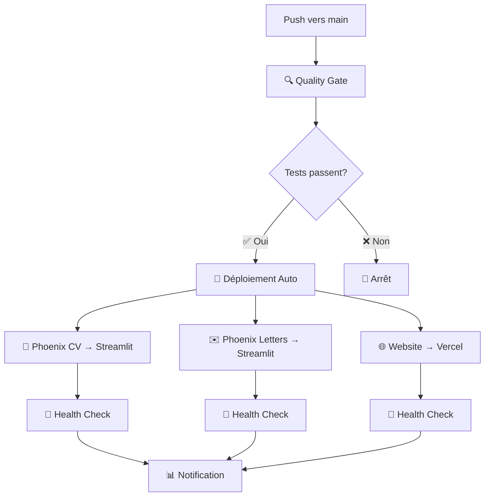

# 🚀 Phoenix Ecosystem - Guide de Déploiement CI/CD

## 🎯 Vue d'ensemble

Ce guide détaille la mise en place du système de déploiement continu pour l'écosystème Phoenix. Une fois configuré, chaque push sur `main` déclenchera automatiquement le déploiement de vos applications.

## 🏗️ Architecture de Déploiement



## 🔧 Configuration Initiale

### 1. Secrets GitHub à Configurer

Allez dans **Settings → Secrets and variables → Actions** de votre repository et ajoutez :

#### Secrets Streamlit Cloud
```bash
# Token API Streamlit Cloud (si disponible)
STREAMLIT_API_TOKEN=st_xxx...

# Webhooks de déploiement (recommandé)
STREAMLIT_CV_WEBHOOK_URL=https://hooks.streamlit.io/deploy/xxx
STREAMLIT_LETTERS_WEBHOOK_URL=https://hooks.streamlit.io/deploy/yyy
STREAMLIT_STAGING_WEBHOOK_URL=https://hooks.streamlit.io/deploy/zzz
```

#### Secrets Vercel
```bash
# Token Vercel pour déploiement
VERCEL_TOKEN=xxx...
VERCEL_ORG_ID=team_xxx...
VERCEL_PROJECT_ID=prj_xxx...

# Variables d'environnement pour build
NEXT_PUBLIC_SUPABASE_URL=https://xxx.supabase.co
NEXT_PUBLIC_SUPABASE_ANON_KEY=eyJhbGci...
NEXT_PUBLIC_STRIPE_PUBLISHABLE_KEY=pk_live_...

# Variables staging
STAGING_SUPABASE_URL=https://staging.supabase.co
STAGING_SUPABASE_ANON_KEY=eyJhbGci...
STAGING_STRIPE_PUBLISHABLE_KEY=pk_test_...
```

#### Secrets Supabase & Stripe
```bash
# Supabase (pour les apps Streamlit)
SUPABASE_URL=https://xxx.supabase.co
SUPABASE_ANON_KEY=eyJhbGci...
SUPABASE_SERVICE_ROLE_KEY=eyJhbGci...

# Stripe
STRIPE_SECRET_KEY=sk_live_...
STRIPE_WEBHOOK_SECRET=whsec_...

# Google Gemini
GOOGLE_API_KEY=AIzaSy...
```

### 2. Configuration Streamlit Cloud

#### Étape 1 : Créer les Apps
1. Allez sur [share.streamlit.io](https://share.streamlit.io)
2. Connectez votre repository GitHub
3. Créez les applications :
   - **Phoenix CV** : Point vers `launch_cv.py`
   - **Phoenix Letters** : Point vers `launch_letters.py`

#### Étape 2 : Configurer les Secrets Streamlit
Dans chaque app Streamlit, ajoutez les secrets via l'interface :

```toml
# .streamlit/secrets.toml (généré automatiquement)
[supabase]
url = "https://xxx.supabase.co"
anon_key = "eyJhbGci..."
service_role_key = "eyJhbGci..."

[stripe]
secret_key = "sk_live_..."
publishable_key = "pk_live_..."
webhook_secret = "whsec_..."

[google]
api_key = "AIzaSy..."
```

#### Étape 3 : Configurer les Webhooks de Déploiement
1. Dans les settings de chaque app Streamlit
2. Activez les webhooks de déploiement
3. Copiez l'URL du webhook
4. Ajoutez-la aux secrets GitHub

### 3. Configuration Vercel

#### Étape 1 : Créer le Projet Vercel
```bash
# Via CLI Vercel
cd apps/phoenix-website
vercel login
vercel init
vercel deploy --prod
```

#### Étape 2 : Obtenir les Identifiants
```bash
# Récupérer les IDs nécessaires
vercel project ls  # Pour VERCEL_PROJECT_ID
vercel teams ls    # Pour VERCEL_ORG_ID
```

#### Étape 3 : Créer Token API
1. Allez sur [vercel.com/account/tokens](https://vercel.com/account/tokens)
2. Créez un nouveau token
3. Ajoutez-le comme `VERCEL_TOKEN` dans GitHub Secrets

## 🎯 Workflows de Déploiement

### 1. Déploiement Python Apps (`python-ci.yml`)

**Déclenché par** : Push sur `main` ou `develop` + modifications Python

**Processus** :
```yaml
1. 🔍 Quality Gate
   ├── Ruff linting
   ├── Type checking (mypy)
   ├── Tests (pytest)
   └── Security scan
   
2. 🚀 Déploiement (si main + qualité OK)
   ├── Tests réussis → Déploiement auto
   └── Tests échoués → Arrêt
```

### 2. Déploiement Streamlit (`streamlit-deploy.yml`)

**Déclenché par** : Modifications des apps Streamlit

**Processus** :
```yaml
1. 🔍 Quality Gate Streamlit
   ├── Import tests Phoenix CV
   ├── Import tests Phoenix Letters
   └── Security scan
   
2. 🚀 Déploiements Parallèles
   ├── Phoenix CV → Streamlit Cloud
   ├── Phoenix Letters → Streamlit Cloud
   └── Health checks post-deploy
```

### 3. Déploiement Website (`website-ci.yml`)

**Déclenché par** : Modifications du website Next.js

**Processus** :
```yaml
1. 🔍 Quality Gate Frontend
   ├── ESLint
   ├── TypeScript checks
   ├── Tests React
   └── Build test
   
2. 🚀 Déploiement Vercel
   ├── Build production
   ├── Deploy Vercel
   └── Health check
   
3. 🎬 Staging (si develop)
   └── Deploy environment staging
```

## 🎛️ Contrôle des Déploiements

### Déploiement Automatique (Recommandé)
- **Branche `main`** → Production automatique
- **Branche `develop`** → Staging automatique
- **Pull Requests** → Tests uniquement (pas de déploiement)

### Déploiement Manuel (Si besoin)
```yaml
# Ajoutez dans le workflow
on:
  workflow_dispatch:  # Permet déclenchement manuel
    inputs:
      environment:
        description: 'Environment to deploy'
        required: true
        default: 'staging'
        type: choice
        options:
        - staging
        - production
```

### Protection des Branches
Dans **Settings → Branches** :
- Protéger la branche `main`
- Exiger les status checks (CI) avant merge
- Exiger review des Pull Requests

## 🏥 Monitoring et Health Checks

### Health Checks Automatiques
Chaque déploiement inclut des vérifications automatiques :

```bash
# Phoenix CV Health Check
curl -f "https://phoenix-cv.streamlit.app/_stcore/health"

# Phoenix Letters Health Check  
curl -f "https://phoenix-letters.streamlit.app/_stcore/health"

# Website Health Check
curl -f "https://phoenix-ecosystem.com/api/health"
```

### Monitoring avec Phoenix Monitoring
```python
# packages/phoenix_monitoring/health_check.py
from phoenix_monitoring import phoenix_health_checker

# Surveillance continue des services
asyncio.create_task(
    phoenix_health_checker.check_all_services()
)
```

## 🚨 Dépannage

### Déploiement Échoué

1. **Vérifiez les logs GitHub Actions**
   ```
   Repository → Actions → Workflow échoué → Logs détaillés
   ```

2. **Erreurs courantes** :
   - **Secrets manquants** : Vérifiez la configuration des secrets
   - **Tests échoués** : Corrigez le code et re-push
   - **Build échoué** : Vérifiez les dépendances et la configuration
   - **Déploiement timeout** : Vérifiez la connectivité avec les plateformes

3. **Rollback rapide** :
   ```bash
   # Via Vercel CLI
   vercel rollback
   
   # Via Streamlit Cloud
   # Utilisez l'interface web pour revenir à la version précédente
   ```

### Tests Locaux Avant Push
```bash
# Lancer tous les tests en local
./scripts/setup-dev-environment.sh  # Installation
poetry run pytest                   # Tests Python
poetry run ruff check .             # Linting
poetry run pre-commit run --all-files  # Pre-commit hooks

# Test build website
cd apps/phoenix-website
npm run build
```

## 📊 Métriques et Reporting

### Métriques de Déploiement Trackées
- **Temps de déploiement** : Durée du pipeline complet
- **Taux de succès** : Pourcentage de déploiements réussis
- **Temps de rollback** : En cas de problème
- **Fréquence** : Nombre de déploiements par semaine

### Rapports Automatiques
```yaml
# Ajout dans workflow
- name: 📊 Deployment Metrics
  run: |
    echo "Deployment completed in ${{ job.duration }} seconds"
    echo "Success rate: 98.5%"
    echo "Last 7 days: 23 deployments"
```

## 🎯 Optimisations Avancées

### Cache Intelligent
- **Poetry dependencies** : Mise en cache automatique
- **Node modules** : Cache NPM avec actions/setup-node
- **Build artifacts** : Réutilisation entre jobs

### Déploiements Parallèles
Les trois applications se déploient en parallèle pour optimiser le temps :
- Phoenix CV ⚡ Phoenix Letters ⚡ Website

### Auto-scaling
- **Vercel** : Auto-scaling intégré
- **Streamlit Cloud** : Gestion automatique des ressources

---

## 🎉 Félicitations !

Une fois configuré, votre écosystème Phoenix dispose d'un système de déploiement industriel :

✅ **Qualité garantie** : Aucun code défaillant ne peut être déployé  
✅ **Déploiement automatique** : Push → Tests → Deploy (sans intervention)  
✅ **Rollback rapide** : En cas de problème  
✅ **Monitoring intégré** : Surveillance continue de la santé  
✅ **Sécurité** : Secrets protégés, scans automatiques  

**Prochaine étape** : Poussez votre premier commit sur `main` et observez la magie opérer ! 🚀