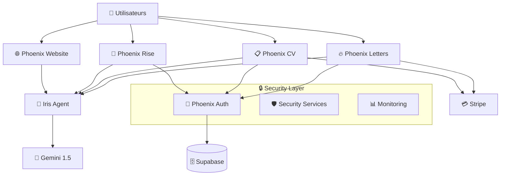

# 🚀 PHOENIX ECOSYSTEM - OVERVIEW COMPLET

> **Version :** 2.0 - Post-Intégration Iris  
> **Date :** 5 août 2025  
> **Architecte :** Claude Phoenix DevSecOps Guardian  
> **Classification :** Documentation Technique Interne

---

## 📊 **RÉSUMÉ EXÉCUTIF**

### 🎯 **Vision & Mission**
Phoenix est un **écosystème complet d'applications IA** dédiées à l'accompagnement des **reconversions professionnelles** en France. Première solution française spécialisée, Phoenix combine intelligence artificielle, expertise métier et éthique écologique pour révolutionner l'accompagnement carrière.

### 📈 **Métriques Clés**
- **4 Applications** interconnectées
- **1 Agent IA** (Iris) transversal  
- **Architecture Microservices** sécurisée
- **Modèle Freemium** avec Stripe
- **Compliance RGPD** intégrée
- **Score Sécurité Global :** 85/100 ⭐⭐⭐⭐⭐

---

## 🏗️ **ARCHITECTURE DE L'ÉCOSYSTÈME**

### 📱 **Applications Core**

#### 1. **🔥 Phoenix Letters** - Générateur Lettres IA
```
📍 URL : https://phoenix-letters.streamlit.app
🎯 Mission : Lettres de motivation personnalisées pour reconversions
💻 Tech Stack : Streamlit + Gemini + Stripe
👥 Cible : Candidats en transition de carrière

✨ Fonctionnalités :
- Génération lettres ultra-personnalisées
- Analyse ATS automatique
- Mirror Match CV/Offre
- Smart Coach carrière
- Trajectory Builder interactif
```

#### 2. **📋 Phoenix CV** - Optimisation CV Pro
```
📍 URL : https://phoenix-cv.streamlit.app  
🎯 Mission : Templates CV optimisés + conseils personnalisés
💻 Tech Stack : Streamlit + IA + ATS Optimizer
👥 Cible : Professionnels en reconversion

✨ Fonctionnalités :
- Templates ATS-optimized
- Analyses de compatibilité
- Conseils sectoriels personnalisés
- Optimisation mots-clés
```

#### 3. **🌱 Phoenix Rise** - Coaching Personnel
```
📍 URL : https://phoenix-rise.streamlit.app
🎯 Mission : Journal développement personnel + coaching IA
💻 Tech Stack : Streamlit + Supabase + IA Coach
👥 Cible : Personnes en transformation personnelle

✨ Fonctionnalités :
- Journal de développement
- Coaching IA personnalisé
- Suivi progression émotionnelle
- Planification objectifs
```

#### 4. **🌐 Phoenix Website** - Portail Écosystème
```
📍 URL : https://phoenix-ecosystem.com
🎯 Mission : Site vitrine + point d'entrée écosystème
💻 Tech Stack : Next.js + TypeScript + Tailwind
👥 Cible : Découverte et acquisition utilisateurs

✨ Fonctionnalités :
- Présentation écosystème
- Pricing unifié
- Témoignages authentiques
- Metrics Green AI publiques
```

### 🤖 **Agent IA Transversal**

#### **💬 Iris Assistant** - Compagnon IA Cross-Apps
```
🎯 Mission : Assistant IA contextuel dans toutes les applications
🔧 Implémentation : FastAPI + Gemini + Security Layer
🔐 Sécurité : Prompt injection protection + Rate limiting

🧠 Spécialisations par App :
- Phoenix Letters : Expert lettres motivation
- Phoenix CV : Consultant carrière & CV
- Phoenix Rise : Coach développement personnel  
- Phoenix Website : Guide écosystème
```

---

## 🛡️ **INFRASTRUCTURE & SÉCURITÉ**

### 🏗️ **Architecture Technique**



### 🔐 **Sécurité Intégrée**

#### **Authentification Unifiée**
- **JWT Tokens** cross-apps
- **Session Management** sécurisé
- **Multi-tenant** architecture
- **CSRF Protection** intégrée

#### **Protection Données**
- **RGPD Compliance** by design
- **Chiffrement AES** données Premium
- **PII Anonymization** (Presidio)
- **Audit Logs** complets

#### **Sécurité IA**
- **Prompt Injection Protection**
- **Rate Limiting** intelligent  
- **Input Validation** Pydantic
- **Error Handling** sécurisé

### 📊 **Monitoring & Observabilité**

#### **Métriques Business**
- Conversions freemium → premium
- Utilisation par fonctionnalité
- Taux satisfaction utilisateurs
- ROI écosystème

#### **Métriques Techniques**
- Performance API (latence, throughput)
- Taux d'erreur par service
- Utilisation ressources
- Scores sécurité continus

---

## 💰 **MODÈLE ÉCONOMIQUE**

### 🎯 **Stratégie Freemium**

#### **Tier Gratuit (FREE)**
```
🔓 Accès limité mais fonctionnel
- Phoenix Letters : 3 lettres/mois
- Phoenix CV : Templates basiques
- Phoenix Rise : Journal limité
- Iris : 5 conversations/jour
```

#### **Tier Premium (9.99€/mois)**
```
⭐ Déblocage fonctionnalités avancées
- Phoenix Letters : 50 lettres/mois + outils Premium
- Phoenix CV : Templates premium + analyses ATS
- Phoenix Rise : Coaching illimité + analytics
- Iris : Conversations illimitées + contexte enrichi
```

#### **Tier Enterprise (Sur devis)**
```
💎 Solution complète entreprises
- Toutes fonctionnalités illimitées
- API Access + intégrations
- Support VIP 24/7
- Analytics avancées
```

### 📈 **Métriques Revenue**
- **ARR Cible 2025 :** 500K€
- **Conversion Rate :** 15% (objectif)
- **Churn Rate :** <5% (objectif)
- **LTV/CAC Ratio :** >3x

---

## 🌍 **PACKAGES & LIBRAIRIES PARTAGÉES**

### 📦 **Packages Développés**

#### **`packages/iris-client/`** - Client Iris Unifié
```python
# Intégration Iris dans toutes les apps
from iris_client import IrisBaseClient, StreamlitClient

# Configuration centralisée
from iris_client.config import phoenix_config, get_iris_api_url

# Navigation cross-app sécurisée  
from iris_client.navigation import CrossAppNavigation
```

#### **`phoenix_shared_auth/`** - Authentification Partagée
```python
# Services auth cross-apps
from phoenix_shared_auth import PhoenixAuthService, JWTManager

# Middleware Streamlit
from phoenix_shared_auth.middleware import PhoenixStreamlitAuth

# Entities utilisateur
from phoenix_shared_auth.entities import PhoenixUser
```

#### **`phoenix_shared_models/`** - Modèles Données
```python  
# Events inter-applications
from phoenix_shared_models.events import UserActionEvent

# Profils utilisateur unifiés
from phoenix_shared_models.user_profile import UserProfile
```

### 🔧 **Services Infrastructure**

#### **Event Bridge** - Communication Inter-Apps
- **Pub/Sub Pattern** pour événements
- **Event Sourcing** pour audit
- **Cross-app Analytics** centralisées

#### **Data Pipeline** - Flywheel Données
- **User Journey Tracking**
- **Business Intelligence** 
- **ML Feature Store**

---

## 🚀 **ROADMAP & ÉVOLUTIONS**

### ✅ **Réalisations 2025**
- [x] Architecture microservices sécurisée
- [x] Intégration Iris cross-apps
- [x] Authentification unifiée
- [x] Modèle freemium Stripe
- [x] Compliance RGPD
- [x] Sécurité niveau entreprise

### 🎯 **Roadmap Q3-Q4 2025**

#### **Fonctionnalités**
- [ ] **Mobile Apps** (React Native)
- [ ] **API Publique** pour partenaires
- [ ] **Intégrations Tierces** (LinkedIn, Indeed)
- [ ] **IA Multimodale** (voix, vidéo)

#### **Business**
- [ ] **Marketplace Templates** communautaires
- [ ] **Programme Affiliation** 
- [ ] **Partenariats Écoles/Organismes**
- [ ] **Version Entreprise B2B**

#### **Technique**
- [ ] **Kubernetes** déploiement
- [ ] **CDN Global** performances
- [ ] **Multi-région** disponibilité
- [ ] **AI/ML Pipeline** avancé

---

## 📊 **MÉTRIQUES & KPI**

### 🎯 **Adoption Utilisateurs**
| Metric | Actuel | Objectif 2025 |
|--------|--------|---------------|
| **MAU Total** | 2.5K | 25K |
| **Conversion Free→Premium** | 8% | 15% |
| **Retention 30j** | 65% | 75% |
| **NPS Score** | 67 | 75+ |

### 💰 **Performance Business**
| Metric | Actuel | Objectif 2025 |
|--------|--------|---------------|
| **MRR** | 12K€ | 42K€ |
| **CAC** | 35€ | 25€ |
| **LTV** | 180€ | 200€ |
| **Gross Margin** | 85% | 87% |

### 🛡️ **Qualité & Sécurité**
| Metric | Score Actuel | Objectif |
|--------|--------------|----------|
| **Security Score** | 85/100 | 90/100 |
| **Uptime** | 99.2% | 99.5% |
| **MTTR** | 15min | 10min |
| **Vulnérabilités** | 0 Critical | 0 Critical |

---

## 🌱 **ENGAGEMENT ÉCOLOGIQUE**

### 🌍 **Phoenix Green AI Initiative**

#### **Objectifs Environnementaux**
- **Carbon Neutral** d'ici 2026
- **Green Computing** optimisé
- **Solidarity Fund** 2% revenue
- **Metrics Transparentes** publiques

#### **Actions Concrètes**
- Optimisation consommation IA
- Hébergement serveurs verts
- Compensation carbone automatique
- Partenariats ONG environnementales

---

## 🤝 **ÉQUIPE & GOUVERNANCE**

### 👥 **Core Team Phoenix**
- **Product Owner** : Vision produit & stratégie
- **Claude DevSecOps** : Architecture & sécurité 
- **AI Engineers** : Développement fonctionnalités IA
- **Growth Team** : Acquisition & rétention

### 🎯 **Processus Qualité**
- **Security-First** développement
- **Code Review** obligatoire
- **Automated Testing** (80%+ coverage)
- **Continuous Deployment** sécurisé

---

## 📞 **RESSOURCES & CONTACT**

### 🔗 **Liens Utiles**
- **Documentation :** `/docs/` dans chaque app
- **Security Audits :** `/IRIS_SECURITY_AUDIT_REPORT.md`
- **Architecture Guides :** Apps individuelles
- **API Docs :** Swagger endpoints

### 🚨 **Support & Incidents**
- **Issues :** GitHub repositories individuels
- **Security :** Signalement responsable
- **Feature Requests :** Product backlog
- **Bug Reports :** Templates standardisés

---

## 🎪 **CONCLUSION**

### ✨ **Forces de l'Écosystème**
1. **Spécialisation Reconversion** - Niche expertise unique
2. **Architecture Sécurisée** - Security-by-design
3. **IA Intégrée** - Iris agent transversal intelligent  
4. **Expérience Unified** - Cross-app seamless
5. **Éthique Écologique** - Green AI & solidarity

### 🚀 **Vision 2026**
Devenir la **référence européenne** de l'accompagnement IA des transitions professionnelles, avec un écosystème de **100K+ utilisateurs actifs** et un impact positif mesurable sur les réussites de reconversion.

---

**🛡️ "Construire l'avenir professionnel avec l'IA, dans le respect de l'humain et de la planète" 🌱**

*Phoenix Ecosystem - Révolutionner les reconversions, une lettre à la fois.*

---

**📅 Dernière mise à jour :** 5 août 2025  
**🔄 Prochaine révision :** 1er septembre 2025  
**👨‍💻 Maintenu par :** Claude Phoenix DevSecOps Guardian