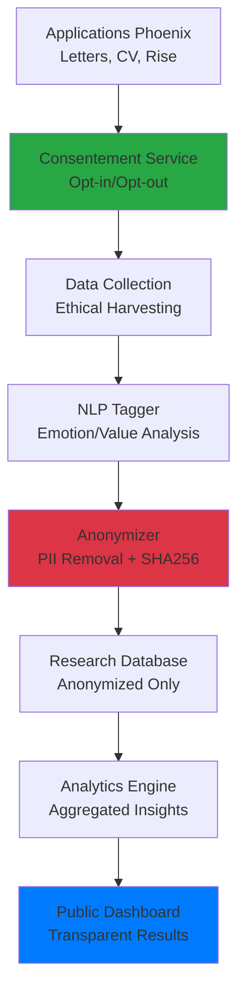

# 🔬 **RECHERCHE-ACTION PHOENIX**
## *Impact de l'IA dans la Reconversion Professionnelle*

---

**📅 Date de Publication :** Janvier 2025  
**🔖 Version :** 1.0.0 - Lancement  
**✍️ Responsable Technique :** Claude Phoenix DevSecOps Guardian  
**🏛️ Organisation :** Phoenix Creator - Écosystème Phoenix  
**🌐 Contact Recherche :** recherche@phoenix-creator.fr  

---

## 🎯 **VISION & MISSION**

### **Vision Stratégique**
> *"Faire de Phoenix la première plateforme d'IA éthique dédiée à l'accompagnement des reconversions professionnelles, en construisant un pont entre innovation technologique et dignité humaine."*

### **Mission de Recherche**
**Objectif Principal :** Comprendre et optimiser l'impact de l'intelligence artificielle dans l'accompagnement des personnes en reconversion professionnelle, en privilégiant une approche éthique et centrée sur l'humain.

### **Questions de Recherche Fondamentales**
1. **Comment l'IA peut-elle mieux accompagner les transitions professionnelles ?**
2. **Quels sont les besoins émotionnels et psychologiques non couverts dans les reconversions ?**
3. **Comment personnaliser l'accompagnement IA sans introduire de biais discriminants ?**
4. **Quel est l'impact des outils IA sur l'estime de soi et la confiance en reconversion ?**

---

## 🧪 **MÉTHODOLOGIE DE RECHERCHE**

### **🔍 Approche Recherche-Action**
- **Terrain :** Utilisateurs réels de l'écosystème Phoenix (Letters, CV, Rise)
- **Méthode :** Observation participante + analyse de données comportementales anonymisées
- **Temporalité :** Étude longitudinale sur 12-18 mois
- **Échantillon :** 1000+ participants volontaires avec consentement explicite

### **📊 Collecte de Données Éthique**

#### **1. Consentement Explicite & Révocable**
```
✅ Opt-in volontaire dans chaque application Phoenix
✅ Information transparente sur l'usage des données  
✅ Révocable à tout moment sans impact sur le service
✅ Consentement différencié par type de données
```

#### **2. Données Collectées (Anonymisées)**
- **Données comportementales :** Patterns d'usage, fréquence d'utilisation
- **Données textuelles :** Notes personnelles (analysées par NLP puis anonymisées)
- **Données de feedback :** Satisfaction, utilité perçue des recommandations IA
- **Données démographiques généralisées :** Tranches d'âge, régions (niveau NUTS-1)

#### **3. Données JAMAIS Collectées**
```
❌ Noms, prénoms, adresses
❌ Données de géolocalisation précise  
❌ Informations financières personnelles
❌ Contenu intégral des CV ou lettres générés
❌ Historique de navigation web
```

### **🛡️ Processus d'Anonymisation**

#### **Niveau 1 : Anonymisation Technique**
- **Hachage SHA-256** des identifiants utilisateurs
- **Suppression automatique** des données PII (Presidio + règles custom)
- **Généralisation temporelle** (mois/années au lieu de dates précises)
- **Généralisation géographique** (régions au lieu de villes)

#### **Niveau 2 : Analyse NLP Éthique**
- **Tagger émotionnel/valeur** : Extraction de patterns sémantiques anonymes
- **Classification de phases** : Identification des étapes de transition
- **Agrégation statistique** : Pas de données individuelles identifiables

#### **Niveau 3 : Export Recherche**
- **Données agrégées uniquement** : Statistiques de groupe
- **Seuil de k-anonymat** : Minimum 5 utilisateurs par catégorie
- **Validation croisée** : Double vérification de l'anonymisation

---

## 🏗️ **ARCHITECTURE TECHNIQUE**

### **🔧 Stack Technologique Éthique**



### **📋 Composants Développés**

#### **1. Services d'Intégrité Éthique**
- **`ResearchConsentComponent`** - Gestion du consentement utilisateur
- **`EthicalNLPTagger`** - Analyse sémantique respectueuse
- **`EthicalDataExporter`** - Export anonymisé sécurisé

#### **2. Infrastructure de Données**
- **Base de données recherche** - Séparée des données de production
- **Pipeline d'anonymisation** - Traitement automatisé et vérifiable
- **Système d'audit** - Traçabilité des traitements éthiques

#### **3. Interface Publique**
- **Dashboard de recherche** - Visualisation transparente des résultats
- **API publique** - Accès aux insights agrégés pour la communauté scientifique

---

## 🛡️ **CHARTE ÉTHIQUE**

### **🎭 Principes Directeurs**

#### **1. Transparence Absolue**
- **Code source ouvert** pour les composants de recherche
- **Méthodologie publique** et reproductible
- **Résultats en accès libre** sur le dashboard public
- **Publications scientifiques** en open access

#### **2. Respect de la Personne**
- **Consentement libre et éclairé** à chaque étape
- **Droit à l'oubli** effectif et immédiat
- **Non-commercialisation** des données personnelles
- **Bénéfice partagé** : amélioration du service pour tous

#### **3. Responsabilité Sociale**
- **Impact positif** : recherche au service de l'intérêt général
- **Non-discrimination** : pas de biais algorithmiques renforcés
- **Inclusion** : attention aux populations vulnérables
- **Durabilité** : approche Green AI intégrée

### **🚫 Engagements Fermes**

```
❌ JAMAIS DE REVENTE de données personnelles
❌ JAMAIS DE PROFILAGE à des fins commerciales
❌ JAMAIS DE PARTAGE avec des tiers sans consentement
❌ JAMAIS DE RE-IDENTIFICATION des données anonymisées
❌ JAMAIS D'USAGE en dehors des finalités de recherche déclarées
```

### **✅ Garanties Positives**

```
✅ TOUJOURS respecter le RGPD et les réglementations
✅ TOUJOURS permettre le retrait du consentement
✅ TOUJOURS publier les résultats en open access
✅ TOUJOURS améliorer les services grâce aux insights
✅ TOUJOURS contribuer à la recherche publique
```

---

## 📈 **RÉSULTATS ATTENDUS & IMPACT**

### **🎓 Contributions Scientifiques**

#### **1. Publications Académiques**
- **Article de recherche principal** : "IA Éthique et Reconversion Professionnelle"
- **Communications congrès** : Conférences en IA, psychologie du travail
- **Dataset public** : Données anonymisées pour la communauté recherche
- **Méthodologie reproductible** : Guide pour d'autres études similaires

#### **2. Innovations Méthodologiques**
- **Framework d'IA éthique** pour l'accompagnement professionnel
- **Métriques d'impact social** pour les outils de reconversion
- **Protocoles d'anonymisation** adaptés aux données de reconversion
- **Guidelines UX** pour les interfaces d'accompagnement IA

### **🌍 Impact Sociétal**

#### **1. Amélioration des Services Phoenix**
- **Personnalisation intelligente** basée sur les insights éthiques
- **Détection précoce** des besoins de soutien psychologique
- **Recommandations contextuelles** adaptées aux phases de transition
- **Interface optimisée** pour réduire l'anxiété de reconversion

#### **2. Bénéfices pour l'Écosystème**
- **Meilleur accompagnement** pour les futurs utilisateurs
- **Réduction du stress** lié aux transitions professionnelles
- **Démocratisation** des outils d'aide à la reconversion
- **Modèle économique éthique** : freemium sans exploitation des données

### **📊 Métriques de Succès**

| **Indicateur** | **Cible 12 Mois** | **Impact Attendu** |
|----------------|-------------------|-------------------|
| Participants consentants | 1000+ utilisateurs | Base statistique robuste |
| Publications scientifiques | 2 articles peer-reviewed | Reconnaissance académique |
| Amélioration satisfaction | +15% vs baseline | Impact utilisateur mesurable |
| Réduction anxiété reconversion | -20% (auto-évaluation) | Bien-être psychologique |
| Adoption open source | 50+ forks du code | Diffusion de la méthode |

---

## 🤝 **PARTENARIATS & COLLABORATION**

### **🏛️ Partenaires Recherche Recherchés**

#### **1. Laboratoires Académiques**
- **CNAM** - Laboratoire Interdisciplinaire de Recherche en Sciences de l'Action
- **Sciences Po** - Centre de Recherche sur le Travail et le Développement
- **Université Paris-Dauphine** - LAMSADE (IA et Décision)
- **INRIA** - Équipes IA Éthique et Interaction Humain-Machine

#### **2. Organismes Institutionnels**
- **Pôle Emploi** - Direction de la Transformation et de l'Innovation
- **CNIL** - Commission Nationale de l'Informatique et des Libertés
- **APEC** - Observatoire de l'Emploi Cadre
- **France Stratégie** - Laboratoire d'Anticipation et de Prospective

#### **3. Associations & Think Tanks**
- **AlgoTransparency** - Transparence algorithmique
- **AI for Humanity** - IA éthique et société
- **Hub Institute** - Transformation digitale responsable

### **💡 Modèles de Collaboration**

#### **1. Convention de Recherche (CIFRE)**
- **Financement** : Bourse doctorale ANRT
- **Durée** : 3 ans
- **Objectif** : Thèse sur "IA Éthique en Accompagnement Professionnel"

#### **2. Partenariat Data Sharing**
- **Données anonymisées** mises à disposition
- **API publique** d'accès aux insights
- **Co-publication** des résultats

#### **3. Consortium de Recherche**
- **Réseau européen** sur l'IA éthique au travail
- **Financement Horizon Europe** : IA et Future of Work
- **Standards industriels** pour l'éthique IA RH

---

## 🚀 **PROCHAINES ÉTAPES**

### **📅 Roadmap de Déploiement**

#### **Phase 1 : Fondations (Janvier-Mars 2025)** ✅
- [x] Implémentation consentement éthique dans toutes les apps
- [x] Développement NLP Tagger émotion/valeur
- [x] Création module export anonymisé
- [x] Construction dashboard de recherche public
- [x] Rédaction fiche projet complète

#### **Phase 2 : Collecte & Validation (Avril-Juin 2025)**
- [ ] Lancement campagne d'information utilisateurs
- [ ] Début collecte données avec consentement
- [ ] Validation méthodologique avec partenaires académiques
- [ ] Premier export dataset anonymisé
- [ ] Publication dashboard public avec données réelles

#### **Phase 3 : Analyse & Publications (Juillet-Décembre 2025)**
- [ ] Analyse approfondie des patterns de reconversion
- [ ] Développement insights pour amélioration produits
- [ ] Rédaction première publication scientifique
- [ ] Communication congrès internationaux
- [ ] Open sourcing des composants de recherche

#### **Phase 4 : Scale & Impact (2026)**
- [ ] Extension à d'autres contextes professionnels
- [ ] Partenariats institutionnels renforcés
- [ ] Industrialisation du framework éthique
- [ ] Formation d'une communauté de recherche

### **🎯 Objectifs Immédiats (30 jours)**

1. **Finaliser l'intégration** des bannières dans toutes les applications
2. **Tester le pipeline complet** de collecte à dashboard
3. **Contacter 3 laboratoires** pour partenariats potentiels
4. **Publier le projet** sur GitHub avec licence open source
5. **Créer la landing page** dédiée à la recherche-action

---

## 📞 **CONTACT & RESSOURCES**

### **🌐 Liens Utiles**
- **Site Principal :** [https://phoenix-creator.fr](https://phoenix-creator.fr)
- **Dashboard Recherche :** [https://research.phoenix-creator.fr](https://research.phoenix-creator.fr) *(à venir)*
- **Repository GitHub :** [https://github.com/phoenix-creator/research-action](https://github.com/phoenix-creator/research-action) *(à venir)*
- **Documentation API :** [https://api.phoenix-creator.fr/research/docs](https://api.phoenix-creator.fr/research/docs) *(à venir)*

### **📧 Contacts Recherche**
- **Responsable Recherche :** recherche@phoenix-creator.fr
- **Partenariats Académiques :** partnerships@phoenix-creator.fr
- **Éthique & Conformité :** ethics@phoenix-creator.fr
- **Support Technique :** tech@phoenix-creator.fr

### **📚 Ressources Complémentaires**
- **Bibliographie Scientifique :** [Zotero Public Group](https://www.zotero.org/groups/phoenix-research)
- **Code de Conduite Éthique :** [ethics.phoenix-creator.fr](https://ethics.phoenix-creator.fr)
- **FAQ Utilisateurs :** [help.phoenix-creator.fr/research](https://help.phoenix-creator.fr/research)

---

## 🏆 **CONCLUSION**

### **🌟 L'Engagement Phoenix**

**Phoenix ne se contente pas d'être un outil technologique.** Nous construisons un **projet d'utilité publique** qui place l'éthique et la dignité humaine au cœur de l'innovation en IA.

Cette recherche-action représente notre engagement à :
- **🔬 Contribuer à la connaissance scientifique** sur l'impact de l'IA dans les transitions professionnelles
- **🛡️ Établir de nouveaux standards éthiques** pour l'IA en RH et accompagnement professionnel  
- **🌍 Partager nos découvertes** avec la communauté pour un impact positif maximal
- **🤝 Collaborer avec la recherche publique** pour faire progresser l'IA éthique

### **🚀 Invitation à Participer**

**Vous êtes chercheur, institution, ou simplement citoyen engagé ?**

**Rejoignez-nous dans cette aventure de recherche éthique !**

- **Utilisateurs :** Donnez votre consentement éclairé et contribuez à une IA plus humaine
- **Chercheurs :** Contactez-nous pour des collaborations scientifiques
- **Institutions :** Explorons ensemble de nouveaux modèles d'IA responsable
- **Citoyens :** Suivez nos avancées sur le dashboard public transparent

---

<div align="center">

**🔬 ENSEMBLE, FAISONS DE L'IA UN OUTIL AU SERVICE DE LA DIGNITÉ HUMAINE**

*"La technologie n'est éthique que si elle sert à élever l'humanité."*

---

**📜 Document établi le 7 janvier 2025**  
**🔏 Signature numérique Phoenix Creator**  
**🌍 Pour une IA éthique et inclusive**

</div>