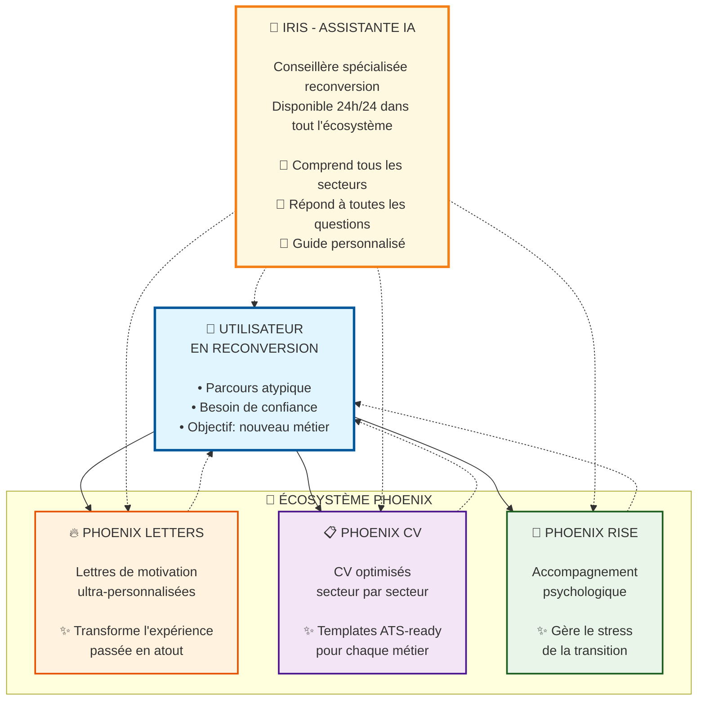
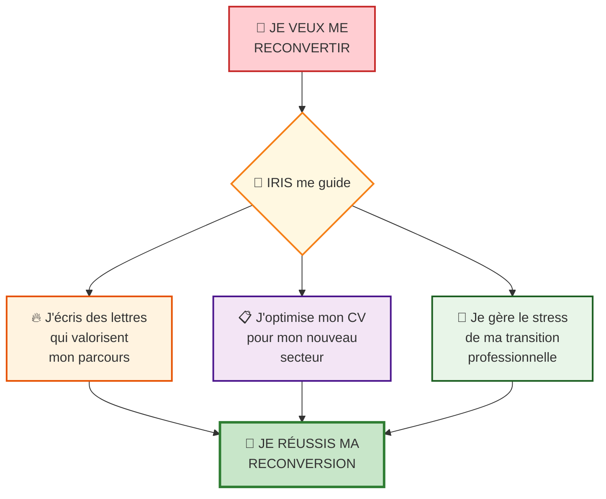
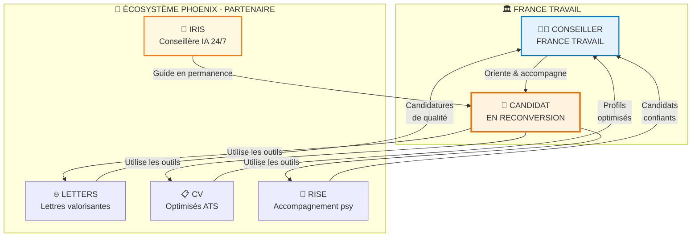

# 🎨 SCHÉMA DE VISION ÉCOSYSTÈME PHOENIX

*Diagrammes visuels pour présentation non-technique*

---

## 📊 **VERSION MERMAID - DIAGRAMME INTERACTIF**



---

## 🎯 **VERSION ASCII ART - POUR DOCUMENTS TEXTE**

```
                    🚀 ÉCOSYSTÈME PHOENIX 🚀
    ┌─────────────────────────────────────────────────────────────┐
    │                                                             │
    │  🤖 IRIS - ASSISTANTE IA TRANSVERSALE                      │
    │  ════════════════════════════════════════                  │
    │  💬 Conseillère spécialisée reconversion 24h/24            │
    │                                                             │
    │   ┌─────────────┐    ┌─────────────┐    ┌─────────────┐   │
    │   │🔥 PHOENIX   │    │📋 PHOENIX   │    │🌱 PHOENIX   │   │
    │   │   LETTERS   │    │     CV      │    │    RISE     │   │
    │   │─────────────│    │─────────────│    │─────────────│   │
    │   │ Lettres de  │    │ CV optimisés│    │Accompagnement│   │
    │   │ motivation  │◄──►│ secteur par │◄──►│psychologique │   │
    │   │ultra-person-│    │   secteur   │    │ transition  │   │
    │   │   nalisées  │    │             │    │             │   │
    │   │             │    │✨ ATS-ready │    │✨ Confiance │   │
    │   │✨ Valorise  │    │   templates │    │  & sérénité │   │
    │   │le parcours  │    │             │    │             │   │
    │   └─────────────┘    └─────────────┘    └─────────────┘   │
    │          ▲                   ▲                   ▲        │
    └──────────┼───────────────────┼───────────────────┼────────┘
               │                   │                   │
               ▼                   ▼                   ▼
         ┌─────────────────────────────────────────────────┐
         │         👤 UTILISATEUR EN RECONVERSION          │
         │         ═══════════════════════════════         │
         │                                                 │
         │  • Parcours atypique (aide-soignant → dev)      │
         │  • Besoin de valoriser son expérience          │
         │  • Recherche de confiance et d'outils          │
         │  • Objectif: réussir sa transition             │
         │                                                 │
         └─────────────────────────────────────────────────┘

    🎯 MISSION: Transformer chaque reconversion en réussite
```

---

## 🌟 **VERSION SIMPLIFIÉE - FOCUS BÉNÉFICES UTILISATEUR**



---

## 🏢 **VERSION PARTENARIAT - INTÉGRATION FRANCE TRAVAIL**



---

## 📱 **VERSION MOBILE/PRÉSENTATION - ULTRA-SIMPLE**

```
          🚀 PHOENIX ECOSYSTEM 🚀
    
    👤 PERSONNE EN RECONVERSION
              │
              ▼
        🤖 IRIS (Guide IA)
              │
     ┌────────┼────────┐
     ▼        ▼        ▼
   
   🔥 LETTERS  📋 CV   🌱 RISE
   Lettres    CV      Mental
   valorise   optimisé soutien
   parcours   ATS     confiance
   
     │        │        │
     └────────┼────────┘
              ▼
    🎯 RECONVERSION RÉUSSIE
```

---

## 🎨 **CONSEILS D'UTILISATION**

### **📊 Version Mermaid** 
- Parfaite pour présentation digitale
- Rendu professionnel et interactif
- À utiliser sur ordinateur/projecteur

### **🎯 Version ASCII Art**
- Idéale pour documents Word/email
- Fonctionne partout (même sans internet)
- Impact visuel garanti

### **🌟 Version Simplifiée**
- Pour expliquer rapidement le concept
- Focus sur l'expérience utilisateur
- Parfaite pour pitch elevator

### **🏢 Version Partenariat**
- Spécialement conçue pour France Travail
- Montre la complémentarité
- Met en valeur le bénéfice mutuel

---

## 🔥 **PHRASES D'ACCOMPAGNEMENT POUR CHAQUE SCHÉMA**

### **Présentation du schéma principal :**
*"Regardez : au centre, notre utilisateur en reconversion. Autour de lui, trois outils spécialisés qui s'entraident. Et Iris, notre IA, qui connecte tout et guide en permanence. C'est ça, l'écosystème Phoenix."*

### **Explication du flux :**
*"L'utilisateur n'utilise pas forcément les trois outils en même temps. Il peut commencer par Phoenix Letters, puis utiliser Phoenix CV, et Iris l'accompagne tout au long. Chaque outil nourrit les autres."*

### **Valeur ajoutée :**
*"Ce qui est unique, c'est qu'Iris comprend le contexte global. Si vous travaillez sur votre CV dans Phoenix CV, Iris sait déjà ce qu'il y a dans votre lettre Phoenix Letters. C'est ça, la puissance de l'écosystème."*

---

**🎨 Choisissez le schéma qui correspond à votre moment de présentation ! 🚀**