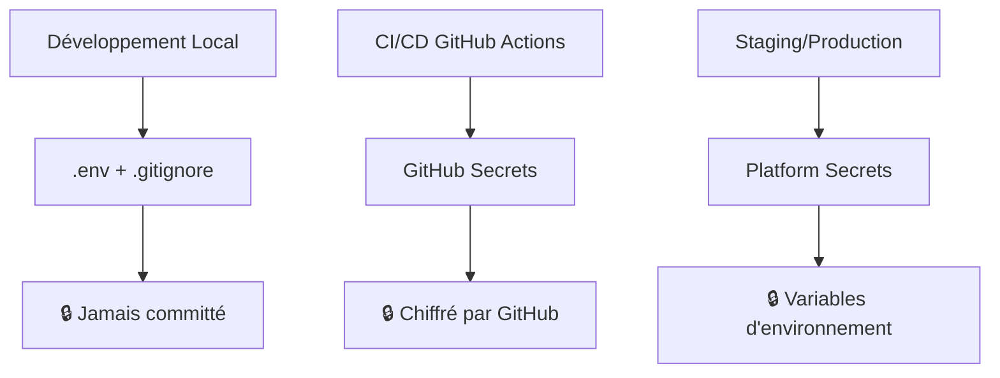

# 🔐 Phoenix Ecosystem - Guide de Gestion des Secrets

## 🎯 Vue d'ensemble

Ce guide détaille la gestion sécurisée des secrets et variables d'environnement pour l'écosystème Phoenix, suivant les meilleures pratiques de sécurité DevSecOps.

## 🏗️ Architecture de Sécurité des Secrets

### Niveaux de Sécurité



### Secrets par Environnement

| Secret | Développement | CI/CD | Production |
|--------|---------------|-------|------------|
| `SUPABASE_URL` | `.env` | GitHub Secrets | Streamlit Secrets |
| `SUPABASE_ANON_KEY` | `.env` | GitHub Secrets | Streamlit Secrets |
| `SUPABASE_SERVICE_ROLE_KEY` | `.env` | GitHub Secrets | Streamlit Secrets |
| `STRIPE_SECRET_KEY` | `.env` | GitHub Secrets | Vercel Env |
| `GOOGLE_API_KEY` | `.env` | GitHub Secrets | Streamlit Secrets |

## 🔧 Configuration par Environnement

### 1. Développement Local

#### Fichier `.env` (à la racine du monorepo)

```bash
# 🔐 Phoenix Ecosystem - Environment Variables
# ⚠️  Ne jamais committer ce fichier !

# Supabase Configuration
SUPABASE_URL=https://your-project.supabase.co
SUPABASE_ANON_KEY=eyJhbGciOiJIUzI1NiIsInR5cCI6IkpXVCJ9...
SUPABASE_SERVICE_ROLE_KEY=eyJhbGciOiJIUzI1NiIsInR5cCI6IkpXVCJ9...

# Stripe Configuration
STRIPE_SECRET_KEY=sk_test_51...
STRIPE_PUBLISHABLE_KEY=pk_test_51...
STRIPE_WEBHOOK_SECRET=whsec_...

# Price IDs pour les produits Phoenix
STRIPE_PRICE_LETTERS_PREMIUM=price_1RraAcDcM3VIYgvyEBNFXfbR
STRIPE_PRICE_CV_PREMIUM=price_1RraUoDcM3VIYgvy0NXiKmKV
STRIPE_PRICE_BUNDLE=price_1RraWhDcM3VIYgvyGykPghCc

# Google Gemini API
GOOGLE_API_KEY=AIzaSy...

# Phoenix Event Bridge Configuration
PHOENIX_EVENT_PERSISTENCE=true
PHOENIX_EVENT_LOGGING=true

# Development Configuration
ENVIRONMENT=development
DEBUG=true
```

#### Protection `.gitignore`

```bash
# Environment variables
.env
.env.local
.env.development
.env.production
.env.staging

# Backup files
*.env.backup
*.env.bak

# IDE files with potential secrets
.vscode/settings.json
.idea/
```

### 2. GitHub Actions (CI/CD)

#### Configuration des Secrets GitHub

1. **Aller dans Settings → Secrets and variables → Actions**
2. **Ajouter les Repository secrets** :

```yaml
# Secrets à configurer dans GitHub
SUPABASE_URL: "https://your-project.supabase.co"
SUPABASE_ANON_KEY: "eyJhbGciOiJIUzI1NiIsInR5cCI6IkpXVCJ9..."
SUPABASE_SERVICE_ROLE_KEY: "eyJhbGciOiJIUzI1NiIsInR5cCI6IkpXVCJ9..."
STRIPE_SECRET_KEY: "sk_test_51..."
GOOGLE_API_KEY: "AIzaSy..."
```

#### Usage dans les workflows

```yaml
# .github/workflows/python-ci.yml
jobs:
  test:
    env:
      SUPABASE_URL: ${{ secrets.SUPABASE_URL }}
      SUPABASE_ANON_KEY: ${{ secrets.SUPABASE_ANON_KEY }}
      STRIPE_SECRET_KEY: ${{ secrets.STRIPE_SECRET_KEY }}
    steps:
      - name: Run tests
        run: poetry run pytest
```

### 3. Production (Streamlit Cloud)

#### Configuration Streamlit Secrets

Fichier `.streamlit/secrets.toml` (pour déploiement) :

```toml
# ⚠️  Ce fichier ne doit PAS être commité
# Il est créé automatiquement par Streamlit Cloud

[supabase]
url = "https://your-project.supabase.co"
anon_key = "eyJhbGciOiJIUzI1NiIsInR5cCI6IkpXVCJ9..."
service_role_key = "eyJhbGciOiJIUzI1NiIsInR5cCI6IkpXVCJ9..."

[stripe]
secret_key = "sk_live_51..."
publishable_key = "pk_live_51..."
webhook_secret = "whsec_..."

[google]
api_key = "AIzaSy..."

[phoenix]
event_persistence = true
event_logging = true
environment = "production"
```

### 4. Production Website (Vercel)

Variables d'environnement Vercel :

```bash
# Via Vercel CLI ou Dashboard
vercel env add SUPABASE_URL
vercel env add SUPABASE_ANON_KEY
vercel env add STRIPE_PUBLISHABLE_KEY
vercel env add GOOGLE_API_KEY
```

## 🛡️ Bonnes Pratiques de Sécurité

### 1. Principe du Moindre Privilège

```python
# ✅ Bon : Utiliser les bonnes clés selon le contexte
class AuthManager:
    def __init__(self):
        # Client-side : utilise anon_key
        self.anon_client = create_client(
            os.getenv("SUPABASE_URL"),
            os.getenv("SUPABASE_ANON_KEY")
        )
    
    def _admin_operation(self):
        # Server-side admin : utilise service_role_key
        admin_client = create_client(
            os.getenv("SUPABASE_URL"),
            os.getenv("SUPABASE_SERVICE_ROLE_KEY")
        )
        return admin_client

# ❌ Mauvais : Utiliser service_role_key partout
```

### 2. Validation des Secrets au Démarrage

```python
# packages/phoenix_shared_auth/client.py
def validate_environment():
    """Valide que tous les secrets requis sont présents"""
    required_secrets = [
        'SUPABASE_URL',
        'SUPABASE_ANON_KEY',
        'STRIPE_SECRET_KEY',
        'GOOGLE_API_KEY'
    ]
    
    missing_secrets = []
    for secret in required_secrets:
        if not os.getenv(secret):
            missing_secrets.append(secret)
    
    if missing_secrets:
        raise EnvironmentError(
            f"❌ Missing required environment variables: {', '.join(missing_secrets)}"
        )
```

### 3. Rotation des Secrets

#### Checklist de Rotation Trimestrielle

- [ ] **Supabase** : Regénérer anon_key dans le dashboard
- [ ] **Stripe** : Créer nouvelles clés dans Stripe Dashboard  
- [ ] **Gemini** : Regénérer API key dans Google Cloud Console
- [ ] **Webhooks** : Regénérer secrets webhook Stripe
- [ ] **Déploiements** : Mettre à jour secrets dans toutes les plateformes

### 4. Monitoring et Alertes

```python
# packages/phoenix_monitoring/secrets_monitor.py
def check_secrets_health():
    """Vérifie la validité des secrets sans les exposer"""
    checks = {
        'supabase': check_supabase_key_validity(),
        'stripe': check_stripe_key_validity(),
        'gemini': check_gemini_key_validity()
    }
    
    for service, is_valid in checks.items():
        if not is_valid:
            logger.error(f"🚨 Secret issue detected for {service}")
            # Alerter mais ne jamais logger la clé
```

## 🚨 Procédures d'Urgence

### En cas de Fuite de Secret

1. **🔴 IMMÉDIAT** : Révoquer le secret dans le service concerné
2. **📞 ALERTER** : Équipe DevSecOps et Product Owner  
3. **🔄 RÉGÉNÉRER** : Nouveau secret dans le service
4. **🔄 DÉPLOYER** : Mise à jour dans tous les environnements
5. **📊 AUDITER** : Vérifier l'usage non autorisé
6. **📝 POST-MORTEM** : Documentation de l'incident

### Scripts d'Urgence

```bash
# scripts/rotate-secrets.sh
#!/bin/bash
echo "🚨 Emergency secret rotation initiated"

# 1. Backup current deployment
echo "📥 Creating backup..."

# 2. Update secrets in services
echo "🔄 Rotating secrets..."

# 3. Update all environments
echo "🚀 Deploying updated secrets..."

# 4. Verify deployment
echo "✅ Verifying deployment..."
```

## 🔍 Audit et Compliance

### Scan de Secrets Automatisé

```yaml
# .github/workflows/security-ci.yml
- name: 🔒 GitLeaks Secret Scan
  uses: gitleaks/gitleaks-action@v2
  env:
    GITHUB_TOKEN: ${{ secrets.GITHUB_TOKEN }}
```

### Checklist Audit Mensuel

- [ ] Aucun secret dans le code source (git log --all --grep="secret\|key\|password")
- [ ] Tous les `.env*` dans `.gitignore`  
- [ ] Secrets GitHub à jour et utilisés
- [ ] Variables production synchronisées
- [ ] Logs sans secrets exposés
- [ ] Tests de validation secrets réussis

## 📋 Templates et Exemples

### Template `.env`

Copier depuis `scripts/setup-dev-environment.sh` qui génère automatiquement un template `.env` lors de l'installation.

### Template Secrets Streamlit

```python
# apps/phoenix-cv/phoenix_cv/config/secrets.py
import streamlit as st
import os

def get_secret(key: str, default: str = None) -> str:
    """Récupère un secret depuis Streamlit ou env"""
    try:
        return st.secrets[key]
    except (KeyError, FileNotFoundError):
        return os.getenv(key, default)

# Usage
SUPABASE_URL = get_secret("supabase.url", os.getenv("SUPABASE_URL"))
```

## 🎯 Validation et Tests

### Script de Validation

```bash
# scripts/validate-secrets.sh
#!/bin/bash
echo "🔍 Validating secrets configuration..."

# Check local env
if [ -f ".env" ]; then
    echo "✅ .env file found"
    # Validate without exposing
    python scripts/validate_env.py
else
    echo "⚠️  .env file not found"
fi

# Check gitignore
if grep -q ".env" .gitignore; then
    echo "✅ .env in .gitignore"
else
    echo "❌ .env NOT in .gitignore - SECURITY RISK!"
fi
```

---

## 📞 Support et Contact

Pour toute question sur la gestion des secrets :

- **🚨 Urgence sécurité** : Créer immédiatement une issue `[SECURITY]`
- **📖 Documentation** : Ce guide + `docs/SECURITY.md`
- **🔧 Scripts** : `scripts/setup-dev-environment.sh`

**🔐 Rappel** : Un secret exposé n'est plus un secret. En cas de doute, toujours régénérer.