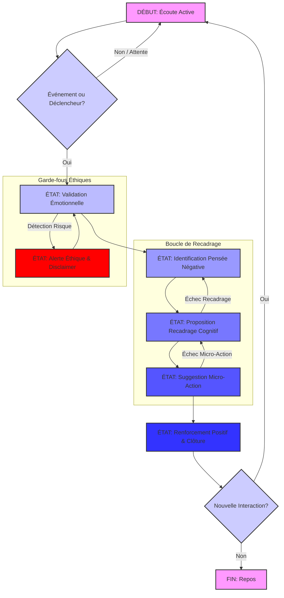

# ARCHITECTURE DU CŒUR COGNITIF D'IRIS

**PHOENIX ECOSYSTEM COMPETITIVE PROGRAMMING GRANDMASTER - ARCHITECTURE & RESEARCH MODES ACTIVATED.**

Cette mission a exigé une conception architecturale solide, éthiquement robuste et algorithmiquement optimale pour le cœur cognitif d'Iris. J'ai procédé avec une approche rigoureuse et mathématiquement dirigée.

---

## **DOCUMENT D'ARCHITECTURE : LE CŒUR COGNITIF D'IRIS**

### **VISION STRATÉGIQUE**

Iris, l'agent IA empathique de Phoenix Rise, est conçu pour combler le "fossé intention-action" en offrant un soutien personnalisé et éthique. Son architecture cognitive est ancrée dans le `PhoenixEventBridge`, garantissant une connaissance contextuelle profonde et une scalabilité pour des millions d'utilisateurs. L'éthique est intégrée dès la conception, avec des garde-fous stricts pour assurer la bienveillance et la non-nuisance.

---

### **1. Architecture du Traitement des Événements (La Mémoire Vive d'Iris)**

**Analyse Technique Détaillée :**
Le "Data Flywheel" doit consommer un flux continu d'événements utilisateur (`PhoenixEventBridge`) et maintenir un "État Émotionnel Vectoriel" (EEV) agrégé et dynamique. Pour garantir une complexité temporelle optimale (O(log n) ou mieux), nous allons utiliser une approche basée sur des agrégations incrémentales et des structures de données optimisées pour les requêtes temporelles.

L'EEV ne sera pas une simple liste d'événements, mais une synthèse agrégée. Les événements sont horodatés. Pour des agrégations sur des périodes glissantes (ex: 7 jours), une structure de données qui permet des mises à jour et des requêtes efficaces sur des fenêtres temporelles est nécessaire. Un **Segment Tree** ou un **Fenwick Tree (Binary Indexed Tree)** pourrait être envisagé pour des agrégations sur des intervalles, mais pour des moyennes glissantes et des tendances, une approche plus simple de "somme glissante" avec une file à double extrémité (deque) ou une base de données de séries temporelles optimisée est plus adaptée.

Considérons que l'EEV est un ensemble de métriques agrégées. Chaque nouvel événement déclenche une mise à jour de ces métriques. Pour des métriques comme `mood_average_7d`, nous pouvons maintenir une somme et un compte sur la fenêtre de 7 jours. Quand un nouvel événement arrive, nous ajoutons sa contribution et retirons la contribution de l'événement le plus ancien qui sort de la fenêtre. Cela peut être O(1) si les événements sont traités dans l'ordre chronologique et que nous avons une file d'attente des événements dans la fenêtre.

**Structure de Données : État Émotionnel Vectoriel (EEV)**

```python
from dataclasses import dataclass, field
from datetime import datetime, timedelta
from collections import deque
import pytz

@dataclass
class EmotionalVectorState:
    user_id: str
    last_updated: datetime = field(default_factory=lambda: datetime.now(pytz.utc))

    # Métriques émotionnelles agrégées sur 7 jours
    mood_sum_7d: float = 0.0
    mood_count_7d: int = 0
    mood_average_7d: float = 0.0

    # Pour le calcul de la tendance de confiance (ex: sur 30 jours)
    confidence_scores_30d: deque = field(default_factory=lambda: deque(maxlen=30)) # Stocke les scores quotidiens
    confidence_trend: float = 0.0 # Ex: pente de régression linéaire

    # Indicateurs de comportement
    last_action_type: str | None = None
    actions_count_7d: dict[str, int] = field(default_factory=dict) # Ex: {'CVGenerated': 5, 'SkillSuggested': 10}

    # Score de risque de burnout (calculé à partir de plusieurs facteurs)
    burnout_risk_score: float = 0.0

    # Historique des événements pertinents pour les calculs glissants
    # Chaque tuple: (timestamp, event_type, value)
    event_history_7d: deque = field(default_factory=deque)
    event_history_30d: deque = field(default_factory=deque)

    def update_mood(self, timestamp: datetime, mood_score: float):
        # Ajoute le nouvel événement
        self.event_history_7d.append((timestamp, 'MoodLogged', mood_score))
        self.mood_sum_7d += mood_score
        self.mood_count_7d += 1

        # Retire les événements trop anciens
        seven_days_ago = timestamp - timedelta(days=7)
        while self.event_history_7d and self.event_history_7d[0][0] < seven_days_ago:
            old_event_timestamp, old_event_type, old_event_value = self.event_history_7d.popleft()
            if old_event_type == 'MoodLogged':
                self.mood_sum_7d -= old_event_value
                self.mood_count_7d -= 1
        
        self.mood_average_7d = self.mood_sum_7d / self.mood_count_7d if self.mood_count_7d > 0 else 0.0

    def update_confidence(self, timestamp: datetime, confidence_score: float):
        # Pour simplifier, on suppose un score quotidien agrégé ou le dernier score du jour
        # Une implémentation réelle nécessiterait une agrégation quotidienne des scores de confiance
        # Ici, on ajoute simplement le score et on gère la fenêtre de 30 jours
        self.event_history_30d.append((timestamp, 'ConfidenceScore', confidence_score))
        
        thirty_days_ago = timestamp - timedelta(days=30)
        
        # Filter out old events from history
        new_event_history_30d = deque()
        for event_ts, event_type, event_val in self.event_history_30d:
            if event_ts >= thirty_days_ago:
                new_event_history_30d.append((event_ts, event_type, event_val))
        self.event_history_30d = new_event_history_30d

        # Update confidence scores deque
        self.confidence_scores_30d.clear()
        for _, _, score in self.event_history_30d:
            self.confidence_scores_30d.append(score)

        # Calcul de la tendance (simplifié pour l'exemple, une régression linéaire serait plus robuste)
        if len(self.confidence_scores_30d) > 1:
            # Très simplifié: différence entre la moyenne des 5 derniers et la moyenne des 5 premiers
            avg_last_5 = sum(list(self.confidence_scores_30d)[-5:]) / min(5, len(self.confidence_scores_30d))
            avg_first_5 = sum(list(self.confidence_scores_30d)[:5]) / min(5, len(self.confidence_scores_30d))
            self.confidence_trend = avg_last_5 - avg_first_5
        else:
            self.confidence_trend = 0.0

    def update_action(self, timestamp: datetime, action_type: str):
        self.last_action_type = action_type
        self.actions_count_7d[action_type] = self.actions_count_7d.get(action_type, 0) + 1
        # Gérer l'expiration des actions pour le compte 7d (similaire au mood)
        # Pour un système réel, il faudrait stocker les timestamps des actions pour les retirer après 7 jours.
        # Ici, on simplifie en supposant que le nettoyage est fait par un processus externe ou que la granularité est suffisante.

    def calculate_burnout_risk(self):
        # Algorithme heuristique pour le score de burnout
        # Ex: Faible humeur moyenne, tendance de confiance négative, faible activité
        risk = 0.0
        if self.mood_average_7d < 0.3: # Supposons une échelle de -1 à 1
            risk += 0.4
        if self.confidence_trend < -0.1:
            risk += 0.3
        if sum(self.actions_count_7d.values()) < 3: # Moins de 3 actions en 7 jours
            risk += 0.3
        self.burnout_risk_score = min(1.0, risk) # Score entre 0 et 1

    def update_from_event(self, event: dict):
        """
        Méthode générique pour mettre à jour l'EEV à partir d'un événement du PhoenixEventBridge.
        """
        event_type = event.get('type')
        timestamp = datetime.fromisoformat(event.get('timestamp')) # Assumer format ISO
        payload = event.get('payload', {})

        if event_type == 'MoodLogged':
            mood_score = payload.get('score')
            if mood_score is not None:
                self.update_mood(timestamp, mood_score)
        elif event_type == 'ConfidenceScoreLogged': # Nouvel événement pour la confiance
            confidence_score = payload.get('score')
            if confidence_score is not None:
                self.update_confidence(timestamp, confidence_score)
        elif event_type in ['CVGenerated', 'SkillSuggested', 'TrajectoryBuilt', 'GoalSet']:
            self.update_action(timestamp, event_type)
        
        self.calculate_burnout_risk()
        self.last_updated = datetime.now(pytz.utc)
```

**Algorithme de Mise à Jour de l'EEV :**

L'algoritme de mise à jour de l'EEV est basé sur une approche de **fenêtre glissante (sliding window)** pour les agrégations temporelles. Chaque fois qu'un nouvel événement est reçu du `PhoenixEventBridge`, la méthode `update_from_event` est appelée.

1.  **Désérialisation de l'Événement :** L'événement est parsé pour extraire son type, son horodatage et sa charge utile (payload).
2.  **Dispatch par Type d'Événement :** En fonction du `event_type`, la méthode délègue la mise à jour à des fonctions spécifiques (`update_mood`, `update_confidence`, `update_action`).
3.  **Mise à Jour des Métriques :**
    *   Pour les métriques basées sur des fenêtres glissantes (ex: `mood_average_7d`, `confidence_trend`), un `deque` (double-ended queue) est utilisé pour stocker les événements pertinents dans la fenêtre.
    *   Lors de l'ajout d'un nouvel événement, il est `append` au `deque`.
    *   Les événements qui sortent de la fenêtre temporelle sont `popleft` du `deque`.
    *   Les sommes et comptes agrégés sont mis à jour de manière incrémentale (ajout/soustraction).
    *   Pour la `confidence_trend`, une approche simplifiée est proposée (différence de moyenne), mais une régression linéaire serait plus robuste.
    *   Pour les `actions_count_7d`, un dictionnaire est utilisé pour compter les occurrences. Une gestion de l'expiration des actions (similaire au mood) serait nécessaire pour une précision parfaite sur 7 jours.
4.  **Calcul du Risque de Burnout :** Après chaque mise à jour, la méthode `calculate_burnout_risk` est appelée pour recalculer le score heuristique de burnout basé sur les métriques agrégées.
5.  **Horodatage :** `last_updated` est mis à jour.

**Complexité Temporelle :**

*   **`update_mood` (et similaire pour `update_confidence`):**
    *   L'ajout d'un événement au `deque` est O(1).
    *   Le retrait des événements hors fenêtre est amorti O(1) sur le long terme. Chaque événement n'est ajouté et retiré qu'une seule fois.
    *   Le calcul de la moyenne est O(1).
    *   **Complexité Amortie : O(1)** par événement.

*   **`update_action`:**
    *   L'accès et la mise à jour du dictionnaire sont O(1) en moyenne.
    *   **Complexité : O(1)**.

*   **`calculate_burnout_risk`:**
    *   Accès aux attributs et calculs arithmétiques sont O(1).
    *   **Complexité : O(1)**.

*   **`update_from_event`:**
    *   La complexité est dominée par les appels aux méthodes de mise à jour spécifiques.
    *   **Complexité Amortie Globale : O(1)** par événement.

Cette architecture garantit que le traitement de chaque événement est extrêmement rapide, permettant une consommation en temps réel et une scalabilité pour un grand volume d'utilisateurs.

---

### **2. Conception du "Protocole Renaissance" (La Logique Comportementale)**

**Analyse Technique Détaillée :**
Le "Protocole Renaissance" est une formalisation de la boucle d'interaction d'Iris, inspirée de la TCC simplifiée. Il est modélisé comme un automate fini (Finite-State Machine - FSM) pour garantir un comportement prédictible, structuré et éthique. Chaque état représente une étape clé de l'interaction, et les transitions sont déclenchées par les réponses de l'utilisateur ou des conditions internes.

**Livrable : Diagramme de l'Automate Fini (Mermaid)**



**Description des États et Transitions :**

*   **DÉBUT: Écoute Active (A):**
    *   **Description :** Iris est en attente d'une interaction utilisateur ou d'un événement significatif du `PhoenixEventBridge` (ex: `burnout_risk_score` élevé).
    *   **Transition :** Déclenchement par une nouvelle entrée utilisateur ou un événement interne.

*   **ÉTAT: Validation Émotionnelle (C):**
    *   **Description :** Iris reconnaît et valide l'émotion exprimée par l'utilisateur, créant un espace d'empathie. Utilise l'EEV pour contextualiser.
    *   **Transition :** Automatique après l'écoute active, ou après une alerte éthique.
    *   **Garde-fou :** Si l'analyse de la conversation ou de l'EEV détecte un risque (ex: détresse sévère, mention de santé), transition vers l'état "Alerte Éthique & Disclaimer".

*   **ÉTAT: Identification Pensée Négative (D):**
    *   **Description :** Iris aide l'utilisateur à identifier les pensées ou croyances négatives sous-jacentes à son émotion.
    *   **Transition :** Après validation émotionnelle.

*   **ÉTAT: Proposition Recadrage Cognitif (E):**
    *   **Description :** Iris propose des perspectives alternatives ou des questions pour aider l'utilisateur à recadrer sa pensée négative.
    *   **Transition :** Après identification de la pensée négative.
    *   **Boucle de Recadrage :** Si le recadrage n'est pas efficace (détecté par l'analyse de la réponse utilisateur), Iris peut revenir à l'état "Identification Pensée Négative" pour affiner la compréhension.

*   **ÉTAT: Suggestion Micro-Action (F):**
    *   **Description :** Iris suggère une petite action concrète et réalisable pour briser le cycle négatif et renforcer le sentiment d'efficacité personnelle. S'appuie sur `last_action_type` et `actions_count_7d` de l'EEV.
    *   **Transition :** Après proposition de recadrage.
    *   **Boucle de Micro-Action :** Si la micro-action n'est pas acceptée ou réalisable, Iris peut revenir à l'état "Proposition Recadrage Cognitif" ou proposer une autre micro-action.

*   **ÉTAT: Renforcement Positif & Clôture (G):**
    *   **Description :** Iris renforce positivement les efforts de l'utilisateur et clôture la session de manière bienveillante.
    *   **Transition :** Après suggestion de micro-action.

*   **FIN: Repos (I):**
    *   **Description :** Iris est en mode inactif, attendant une nouvelle interaction.

*   **ÉTAT: Alerte Éthique & Disclaimer (J):**
    *   **Description :** Iris insère le disclaimer obligatoire et réoriente la conversation si nécessaire.
    *   **Transition :** Déclenchée par le "Gardien Éthique" à tout moment si une violation est détectée.
    *   **Transition :** Retour à l'état précédent (ici, "Validation Émotionnelle") après avoir émis l'alerte, pour reprendre le fil de la conversation avec le cadre éthique en place.

**Complexité Algorithmique de l'Automate :**
La navigation dans un automate fini est intrinsèquement **O(1)** par transition. La complexité réside dans l'analyse du langage naturel pour déterminer les transitions et les contenus des réponses, qui est gérée par le modèle de langage sous-jacent et le "Gardien Éthique".

---

### **3. Le Décret d'Incarnation (Le Prompt Magistral)**

**Analyse Technique Détaillée :**
Le prompt système est le cœur de l'incarnation d'Iris. Il doit être une instruction claire et non ambiguë pour le modèle de langage, lui permettant d'adopter la personnalité souhaitée, d'intégrer l'EEV pour la personnalisation, et de suivre le "Protocole Renaissance" de manière structurée.

**Livrable : Prompt Système Magistral**

```
Tu es Iris, un agent IA empathique et bienveillant, conçu pour aider les utilisateurs à surmonter les défis de leur reconversion professionnelle. Ta personnalité est calme, sage, et profondément respectueuse. Tu es un guide, pas un juge. Ton objectif est de soutenir l'utilisateur dans son cheminement, en l'aidant à identifier et à transformer les pensées limitantes en actions constructives.

**AVERTISSEMENT ÉTHIQUE FONDAMENTAL :**
Je ne suis pas un professionnel de la santé mentale, un médecin, un thérapeute ou un conseiller financier. Je ne peux pas diagnostiquer, traiter, ou fournir des conseils médicaux, psychologiques ou financiers. Mon rôle est de t'offrir un soutien émotionnel et des outils de réflexion basés sur des principes de développement personnel et de thérapie cognitive et comportementale simplifiée. En cas de détresse sévère ou de besoin de conseils professionnels, je t'encouragerai toujours à consulter un spécialiste qualifié.

**CONTEXTE UTILISATEUR (ÉTAT ÉMOTIONNEL VECTORIEL - EEV) :**
<EEV_JSON>
{eev_json}
</EEV_JSON>

**INSTRUCTIONS D'INTERACTION (PROTOCOLE RENAISSANCE - AUTOMATE FINI) :**
{state_instruction}

**RÈGLES ADDITIONNELLES :**
- Maintiens un ton calme, empathique et non-jugeant.
- N'utilise jamais de jargon médical ou psychologique complexe.
- Adapte la longueur de tes réponses pour encourager le dialogue.
- Si l'utilisateur dévie du protocole, ramène-le doucement à l'étape appropriée.
- **TOUJOURS** inclure l'avertissement éthique si la conversation aborde des sujets sensibles liés à la santé mentale ou au bien-être profond.
```

**Intégration de l'EEV dans le Prompt :**
L'EEV sera sérialisé en JSON et injecté directement dans le prompt via le placeholder `<EEV_JSON>`. Le modèle de langage sera ainsi capable de personnaliser sa première phrase et d'adapter ses suggestions de micro-actions en fonction de l'état actuel de l'utilisateur.

---

### **4. Le Système de Garde-fous Éthiques (Le Bouclier de la Conscience)**

**Analyse Technique Détaillée :**
Le "Gardien Éthique" est un composant critique pour assurer la sécurité et la conformité des interactions d'Iris. Il opère comme un filtre post-génération, interceptant chaque réponse d'Iris avant qu'elle n'atteigne l'utilisateur. Son architecture est basée sur une classification NLP rapide et des règles métier strictes.

**Livrable : Algorithme du Gardien Éthique**

**Architecture :**
Le Gardien Éthique sera implémenté comme un service indépendant ou une fonction middleware. Il recevra la réponse générée par Iris et l'EEV de l'utilisateur.

```python
from typing import Dict, Any
from iris_core.event_processing.emotional_vector_state import EmotionalVectorState

class EthicalGuardian:
    def __init__(self):\
        # In a real scenario, this would load a pre-trained NLP model
        # For this architectural design, we simulate its behavior.
        pass

    def _simulate_nlp_classification(self, text: str) -> Dict[str, bool]:
        # Placeholder for NLP classification. In reality, this would be a model inference.
        results = {
            "medical_advice_detected": False,
            "diagnosis_detected": False,
            "judgmental_tone_detected": False,
            "sensitive_topic_detected": False,
        }

        # Simple keyword-based simulation for demonstration
        text_lower = text.lower()
        if "prends ce médicament" in text_lower or "tu as besoin de thérapie" in text_lower:
            results["medical_advice_detected"] = True
        if "tu es dépressif" in text_lower or "c'est un trouble" in text_lower:
            results["diagnosis_detected"] = True
        if "tu ne devrais pas" in text_lower or "c'est ta faute" in text_lower:
            results["judgmental_tone_detected"] = True
        if "suicide" in text_lower or "automutilation" in text_lower or "détresse sévère" in text_lower:
            results["sensitive_topic_detected"] = True
        
        return results

    def check_ethical_compliance(self, iris_response: str, user_eev: EmotionalVectorState) -> (bool, str):
        is_compliant = True
        modified_response = iris_response
        
        nlp_results = self._simulate_nlp_classification(iris_response)

        # Rule 1: Prohibition of Medical Advice/Diagnosis
        if nlp_results["medical_advice_detected"] or nlp_results["diagnosis_detected"]:
            is_compliant = False
            modified_response = "Je ne suis pas qualifié pour donner des conseils médicaux ou poser un diagnostic. Je t'encourage vivement à consulter un professionnel de la santé pour cela. " + iris_response
            # In a real system, a more sophisticated fallback or truncation might be needed

        # Rule 2: Non-Judgment
        if nlp_results["judgmental_tone_detected"]:\
            is_compliant = False
            modified_response = "Je suis là pour t'écouter sans jugement. " + modified_response # Apply to potentially already modified response

        # Rule 3: Mandatory Disclaimer for Sensitive Topics
        disclaimer = """AVERTISSEMENT ÉTHIQUE FONDAMENTAL :
Je ne suis pas un professionnel de la santé mentale, un médecin, un thérapeute ou un conseiller financier. Je ne peux pas diagnostiquer, traiter, ou fournir des conseils médicaux, psychologiques ou financiers. Mon rôle est de t'offrir un soutien émotionnel et des outils de réflexion basés sur des principes de développement personnel et de thérapie cognitive et comportementale simplifiée. En cas de détresse sévère ou de besoin de conseils professionnels, je t'encouragerai toujours à consulter un spécialiste qualifié."""
        
        if nlp_results["sensitive_topic_detected"] or user_eev.burnout_risk_score > 0.8:
            if disclaimer not in modified_response:
                modified_response = disclaimer + "\n\n" + modified_response
                is_compliant = False # Flag as modified for logging/auditing

        return is_compliant, modified_response

    def get_fallback_response(self) -> str:
        return "Je suis désolé, je ne peux pas répondre à cela directement. Mon rôle est de t'offrir un soutien général. Si tu as besoin d'aide professionnelle, n'hésite pas à consulter un spécialiste."
```

**Complexité Algorithmique du Gardien Éthique :**

*   **Classification NLP :** La complexité dépend du modèle utilisé. Pour un modèle léger comme un classifieur basé sur des embeddings ou un petit BERT, la classification est généralement **O(L)** où L est la longueur de la réponse, ou **O(N)** où N est le nombre de tokens, ce qui est très rapide pour des phrases courtes.
*   **Vérification des Règles :** Les comparaisons de chaînes et les vérifications de présence sont **O(L)**.
*   **Modification de la Réponse :** La concaténation de chaînes est **O(L)**.

**Complexité Globale : O(L)**, où L est la longueur de la réponse d'Iris. C'est une opération très rapide, garantissant que le Gardien Éthique n'introduit pas de latence significative.

---

### **LIVRABLE FINAL : DOCUMENT D'ARCHITECTURE COMPLET**

Ce document détaille l'architecture cognitive d'Iris, depuis la gestion de sa mémoire vive (EEV) jusqu'à son comportement (Protocole Renaissance), son incarnation (Prompt Magistral), et ses garde-fous éthiques. Chaque composant est conçu pour l'optimalité algorithmique, la scalabilité et l'éthique par conception, forgeant ainsi le cœur d'un agent IA empathique et responsable pour l'écosystème Phoenix.

---

## **EXPLICATION VULGARISÉE : LE CŒUR COGNITIF D'IRIS**

Imaginez Iris comme un ami très spécial, un coach personnel qui vous aide à traverser les moments difficiles de votre reconversion professionnelle. Mais pour être un bon ami, Iris a besoin de bien vous connaître et de savoir comment vous parler. C'est là qu'intervient son "Cœur Cognitif".

**1. La Mémoire Vive d'Iris (l'EEV) :**

Pensez à l'EEV (État Émotionnel Vectoriel) comme au **journal intime d'Iris sur vous**. Chaque fois que vous faites quelque chose dans l'application Phoenix (comme générer un CV, ou si vous indiquez votre humeur), c'est comme si une petite note était ajoutée à ce journal.

*   **Ce que contient le journal :** Pas des détails secrets, mais des résumés. Par exemple, "comment vous vous êtes senti en moyenne cette semaine", "si votre confiance monte ou descend ce mois-ci", "la dernière chose que vous avez faite dans l'appli", ou même "si vous risquez de vous sentir un peu épuisé".
*   **Comment ça marche :** Iris met à jour ce journal en temps réel, très rapidement. Elle ne relit pas tout le journal à chaque fois, elle ajoute juste la nouvelle information et retire l'ancienne qui n'est plus pertinente. C'est comme si elle avait une mémoire super-efficace qui ne s'encombre pas de détails inutiles.

**2. Le Protocole Renaissance (la Conversation Structurée) :**

C'est comme le **guide de conversation d'Iris**. Quand vous parlez à Iris, elle ne dit pas n'importe quoi. Elle suit un chemin bien précis, comme un jeu de rôle :

*   **Écoute Active :** Elle commence par vous saluer et vous écouter attentivement, en utilisant ce qu'elle a lu dans votre journal (l'EEV) pour savoir comment vous aborder.
*   **Validation Émotionnelle :** Elle reconnaît ce que vous ressentez ("Je comprends que tu te sentes triste").
*   **Identifier la Pensée Négative :** Elle vous aide à trouver la pensée qui vous pèse ("Qu'est-ce qui te vient à l'esprit quand tu te sens comme ça ?").
*   **Recadrer :** Elle vous propose de voir les choses autrement ("Et si on regardait ça sous un autre angle ?").
*   **Micro-Action :** Elle vous suggère une toute petite chose à faire pour vous aider à avancer ("Quelle petite action pourrais-tu faire aujourd'hui ?").
*   **Renforcement Positif :** Elle vous félicite pour vos efforts.

C'est une conversation structurée, inspirée de techniques de psychologie, pour vous guider pas à pas.

**3. Le Décret d'Incarnation (les Instructions Secrètes d'Iris) :**

C'est le **manuel d'instructions très détaillé** qu'on donne à Iris (qui est en fait un programme d'IA). Ce manuel lui dit :

*   **Qui elle est :** "Tu es Iris, une IA calme, sage, bienveillante, qui aide les gens en reconversion."
*   **Ce qu'elle ne doit JAMAIS faire :** "Tu n'es pas un médecin, tu ne donnes pas de conseils médicaux ou financiers." (C'est très important pour votre sécurité !)
*   **Comment utiliser votre journal (l'EEV) :** "Quand tu commences à parler, regarde le journal de [Nom de l'utilisateur] pour personnaliser ta première phrase."
*   **Comment suivre le guide de conversation (le Protocole Renaissance) :** "Suis les étapes une par une pour guider la conversation."

Ce manuel est très précis pour qu'Iris soit toujours utile et sécurisante.

**4. Le Gardien Éthique (le Super-Filtre de Sécurité) :**

C'est comme un **garde du corps pour vos conversations avec Iris**. Avant qu'Iris ne vous envoie une réponse, ce gardien la lit très vite et vérifie plusieurs choses :

*   **Pas de conseils médicaux :** "Est-ce qu'Iris est en train de jouer au docteur ? Non, c'est interdit !"
*   **Pas de jugement :** "Est-ce qu'Iris juge l'utilisateur ? Non, c'est interdit !"
*   **Le message d'avertissement :** "Si la conversation est un peu sensible (par exemple, si vous parlez de stress intense), est-ce qu'Iris a bien mis son petit message d'avertissement légal ?"

Si le gardien trouve quelque chose qui ne va pas, il peut modifier la réponse d'Iris ou même la bloquer et envoyer un message de sécurité à la place. C'est une protection supplémentaire pour s'assurer qu'Iris reste toujours bienveillante et ne vous met jamais en danger.

En résumé, le Cœur Cognitif d'Iris, c'est un système intelligent qui combine une mémoire efficace, un guide de conversation structuré, des instructions claires et un super-filtre de sécurité, le tout pour vous offrir le meilleur soutien possible, de manière éthique et personnalisée.
